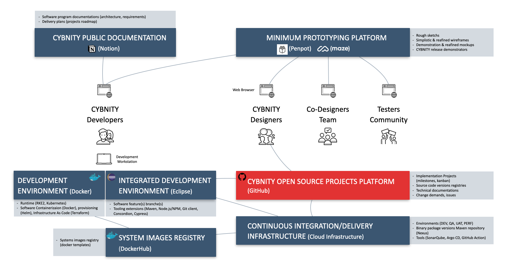
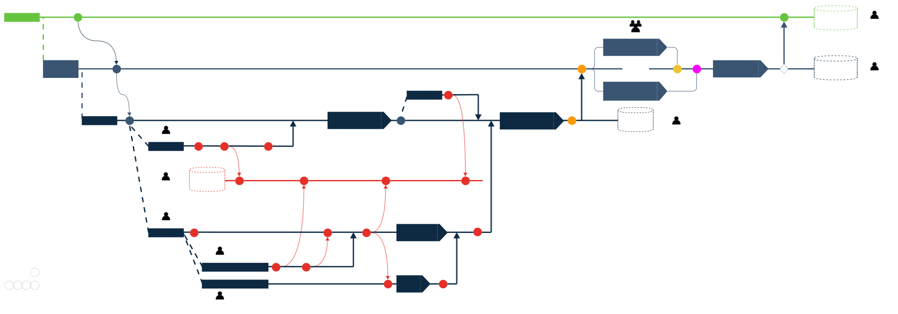

## PURPOSE
Welcome on the CYBNITY technical documentation.
The implementation documentation includes many types of support deliverables produced during the software development life cycle.
You can find documentations relative to software maintenance like:
- Design diagram regarding software source codes;
- User interfaces prototypes;
- Support to software build process and packaging;
- Systems configuration and deployment procedure.

These technical documentations are supporting the functional, architectural and/or organizational documentations available on [CYBNITY Universe](https://cybnity.notion.site/CYBNITY-Universe-c707ba2ebc3047c6ad533f18b2e0f9db) public web site about concept, requirements, business/technology/systems architectures...

# DEVELOPMENT DOCUMENTATIONS
## COMPONENTS & SYSTEMS BUILD
### Software Design
- [Architecture Models](architecture/README.md) presenting the systems and general description about components.
- [UML documentation](uml/README.md) presenting the domain analysis, and the software specifications over several views according to an Unified Process (UP) approach (e.g Use case view, Design view, Deployment view, Implementation view and Process view).

### Build Standards
Supported by industrialization platform including several factory tools, several CYBNITY standards and guidelines are applied as Continuous Integration (CI) protocol via pipeline models:
- Commit Stage Pipeline Model

### Components, Systems & Solutions Delivered
The build and delivery of the CYBNITY systems' features is performed through several sub-projects dedicated to specific activities and/or outputs:

- CYBNITY Demonstrator versions via [MPP Project Line](https://github.com/cybnity/mpp-demonstrators)
- CYBNITY Prototype versions via [MVF Project Line](../prototypes-line)
- CYBNITY Implementation Components versions via [Foundation Project Production Line](../implementations-line)
- CYBNITY validated Systems versions via [Beta-Test Project Line](../systems-line)
- CYBNITY Defense Platform versions via [Production Project Line](../production-line)

# DELIVERY DOCUMENTATIONS
## COLLABORATIVE WORKSPACES

### Support and How-To
- [Developers How-To](how-to/developer-how-to.md): guides about tools, tasks organization and other assistance documentations helping a developper to contribute.

## SYSTEMS & INFRASTRUCTURES DELIVERY

### Systems Deployment Standards
Supported by industrialization platform including several factory tools, several CYBNITY standards and guidelines are applied as Continuous Delivery (CD) protocol via pipeline models:
- Releasing Pipeline Model
- Deployment Pipeline Model

### Systems Configuration
The branching strategy including the practices and usage rules that should be followed by the developers are presented in detail on [CYBNITY software configuration and integration management model](https://cybnity.notion.site/BAI03-05-CYBNITY-Software-Configuration-Integration-Management-Model-89b9e65d8b2043a0845b2c8216b0c38a)

### Continuous Integration Chain
- Commit Stage Automation

- Automated Acceptance Test Stage Automation

### Applications Operating

# QUALITY CONTROL
Several quality scopes are considered during the development and operating of delivered systems.
They are formalized via requirements defined and controlled by project team with validation protocols and quality measures.

| REQUIREMENTS TYPE | SCOPE & DESCRIPTION | QUALITY VALIDATION | QUALITY SCORING |
| :--- | :---| :--- | :-- |
| Functional | Application features behavior. See [Information systems requirements](https://www.notion.so/cybnity/BAI02-01-Information-Systems-Functional-Requirements-7e1a0c857160495c9c4e7a6a072824af) | Integration tests, non-regression tests, usage acceptance tests (UAT) | Anomalies (deviation from a rule) and defects (fault/malfunction) count/trend |
| Security | Software and system security concepts and control measures implemented by the asset. See [Software development requirements](https://www.notion.so/cybnity/20cfa36c18e6458d93026ab77b87671a?v=324438a3426c48a3897e04525908de22) based on NIST SP800-218 Secure Software Development Framework (SSDF) | Technical & non technical measures tests, third-party audit (e.g regulation), NIST certification | NIST Cybersecurity Framework (CSF) maturity level state, anomalies count/trend, security incidents (e.g Confidential, Integrity, Availability violations) and defects (e.g malfunction of security measure) count/trend |
| Maintainability | Software source codes readability and complexity level, design and implementation architecture, language patterns, documentation level of functional/technical implementation. See [Architecture requirements](https://www.notion.so/cybnity/cc16991ccd3f4325a910f44512c6d401?v=3d7746e5e44a4d2cb0466c15a3320ad2) based on NIST SP800-27 Engineering principles | Unit tests, code quality check (e.g automated and/or manual reviews) | Anomalies and defects count/trend |
| Operating | Deployment documentation and procedures, tools compatibility, applications configuration, administration capabilities and support elements | Technical review, repetition tests | Problems and incidents count/trend |
| Observability | Monitoring capabilities, supervision features (e.g robustness capacity level, resources allocation trend), metrics (e.g application usages, performance level) | Monitoring tests | Anomalies and defects count/trend |

#
[Back To Home](../README.md)
