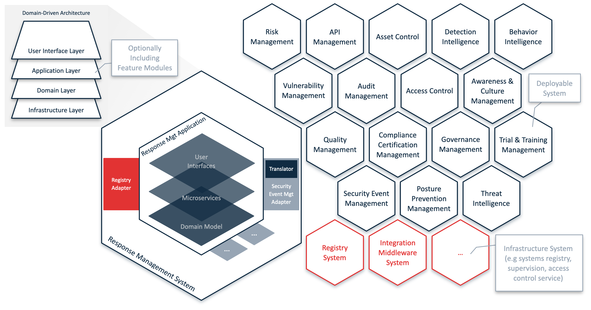

## PURPOSE
This section is presenting some architectures overview regarding the deployable systems delivered by CYBNITY open source program.

Several types of modules constituting the packageable CYBNITY systems are developed via projects structures respecting standard structures:
- Containerized server project structure (Docker tool structure) allowing server templating and virtualization management
- Configuration management project structure (Helm tool structure) allowing repeatable application installation in several runtime context (e.g parameters dedicated to cloudified environments and Kubernetes specific resources)
- Provisionning management project structure (Terraform tool structure) allowing to manage orchestration of Kubernetes cluster and resources automated via Infrastructure-As-Code approach (e.g networking, load balancing, database, users, permissions policies)

# SYSTEMS ARCHITECTURE
Domain-Driven approach is implemented regarding the structure of the applicative components.

The packaging strategy applied on the project provides all the systems ready for execution into a virtual infrastructure (e.g containers) supported by physical infrastructure(s).

## SYSTEMS SOURCE CODES' PROJECTS
The management of several types of modular systems is approached with an integrated vision that mix the best pratices proposed by each used tool, into a global common and compatible architecture of the source codes projects.

## APPLICATIVE SYSTEMS
Each domain service is supported by an independent component which can be deployed in standalone life cycle and which manage the dependencies with other components like specified by the contexts integration model.

The internal components of an application are called *microservices* which implement the business processes (e.g feature modules under the application perimeter's responsibility) regarding a domain context.

## INFRASTRUCTURE SYSTEMS
Several main systems are implemented to be deployed as Internet platform and/or to be executed into a mobile infrastructure (e.g specific components on laptop required by mobile rapid response force members during a move into an incident zone).

The base directory that support the infrastructure-as-code (IaC) implementations is hosted into the [systems folder](/implementations-line/systems/README.md).

A global systems registry allows the discovery of systems to link the context with dynamics approach (at runtime).

#
[Back To Summary](../README.md)
