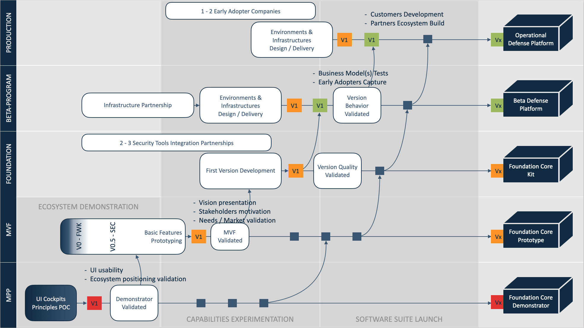

## PURPOSE
Presentation of all projects from the CYBNITY's investment portfolio in alignment with strategy and in a coordinated way, based on a standard program management approach.
According to COBIT 2019 framework implementation (BAI01 practices), this space is dedicated to initiate, plan, control, and execute the program and projects, and monitor expected value from the CYBNITY program.

# PROGRAM MANAGEMENT APPROACH

## PROGRAM BRIEF
Based on several standard methods (e.g Lean UX for requirements validation, MVP for releasing, SCRUM for tasks execution, TOGAF for architecture, COBIT for project's resources governance, and of course, NIST for project's security ;) ).

## PROGRAM CONCEPT BUSINESS CASE

## PROGRAM BENEFIT REALIZATION PLAN

# STAKEHOLDER ENGAGEMENT

## ENGAGEMENT PLAN

## ENGAGEMENT EFFECTIVENESS ASSESSMENTS

# PROGRAM PLAN

## THE PLAN
The general plan give visibility on the main delivery objectives supported by the [components and solutions development guidelines](../docs/uml/implementation/README.md).

### Program 3 Years Trajectory

## PROGRAM BUDGET & BENEFITS REGISTER

## RESOURCE REQUIREMENTS & ROLES

# LAUNCH & EXECUTION

## RESULTS OF GOAL ACHIEVEMENT MONITORING

## RESULTS OF BENEFIT REALIZATION MONITORING

## PROGRAM AUDIT PLANS

# MONITORING, CONTROL & REPORT ON OUTCOMES

## STAGE-GATE REVIEW RESULTS

## RESULTS OF PROGRAM PERFORMANCE REVIEWS

# PROGRAM QUALITY

## QUALITY MANAGEMENT PLAN

## REQUIREMENTS FOR INDEPENDENT VERIFICATION OF DELIVERABLES

# PROGRAM RISKS

## RISK MANAGEMENT PLAN

## PROGRAM RISK REGISTER

## RISK ASSESSMENT RESULTS
#
[Back To Summary](../../README.md)