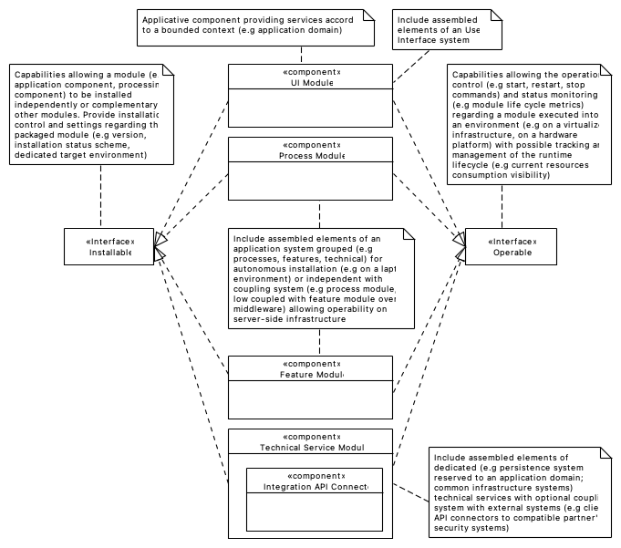
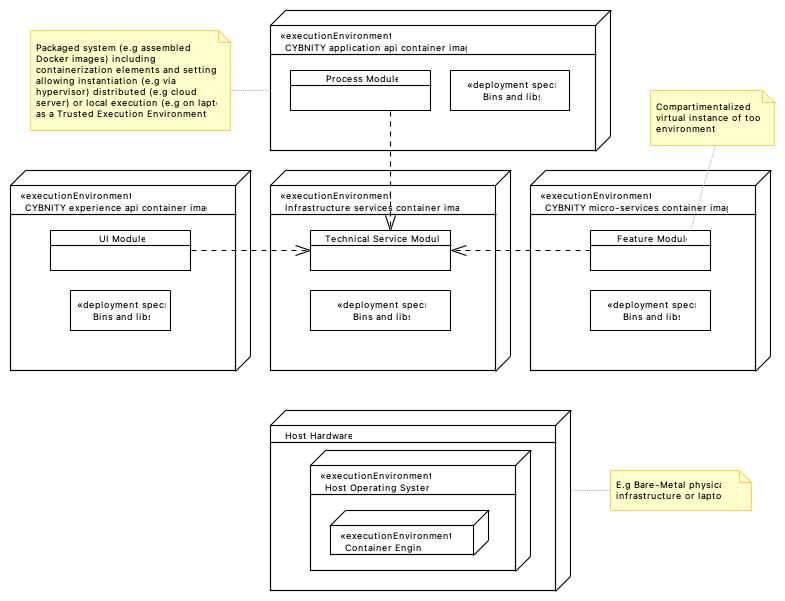
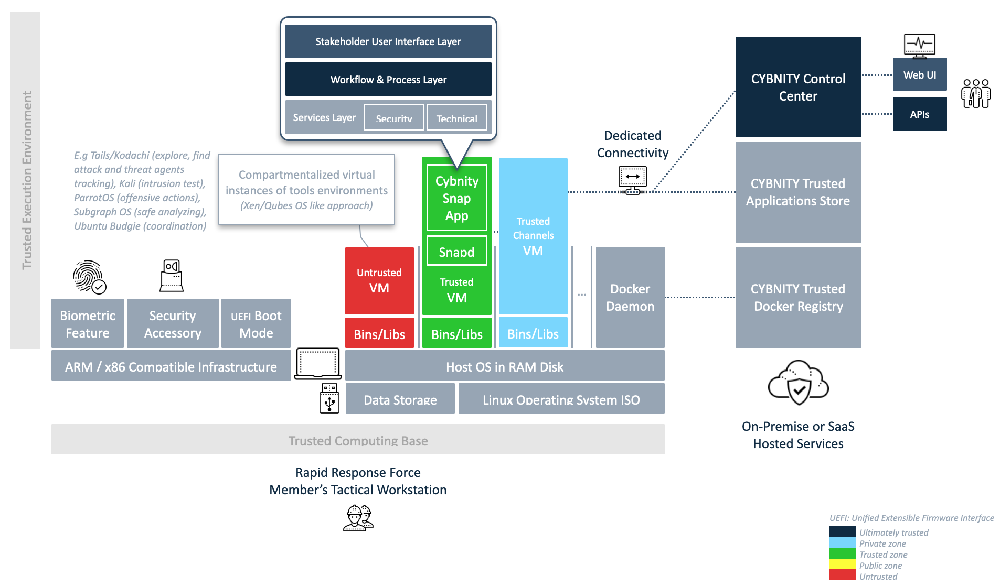

## PURPOSE
Presentation of the system types that are packaged and delivered by the implementation team(s), allowing their installation and operational execution on infrastructure elements.

# PACKAGED COMPONENTS
Presentation of the assembled components (as installable and operable modules), built by the software factory and packaged for installation and start on infrastructures' environment as composed systems.

# SYSTEMS
Presentation of the runnable systems which can be deployed on an infrastructure (e.g in-house, cloud and or execution distributed on mobile physical platforms).

## Containers Based Systems
Each CYBNITY module is packaged as an element according to a Container As a Service (CAS) approach, with containerization contents allowing its deployment and execution into a server infrastructure (e.g in-house, cloud) or on an independent physical hardware (e.g mobile gateway, laptop).

Several Feature modules are optionally execution deployed and executed independently, or in a group of packaged modules constituting a CYBNITY System.

__Example of Tactical Workstation Components Deployment Model__

## Platforms
The isolation of environments (e.g UI experience, application and micro-services), which execute the Systems, implements a Space Based Architecture (SBA) approach to organize the deployment model via an infrastructure providing technical services (e.g network service, persistence systems solution, operations monitoring, security systems).

## Deployment Strategy
The CYBNITY systems are packaged to be deployable into a standard virtualized infrastructure (e.g cloud PAAS provided by Google Cloud, Amazon Web Service, Microsoft Azure, company's in-hosting hybrid platform) that support Docker containerized applications (e.g CYBNITY applications packaged in executable Docker images considered as CYBNITY deployable system) and Kubernetes (e.g CYBNITY virtual cluster of deployable systems).

See the catalog of [CYBNITY deployable systems](https://www.notion.so/cybnity/5a681e57f2164d4f8a3f228129294db9?v=51e2c78132c74b11b97c07ef4e2528c4) for more details about each assembled system.
