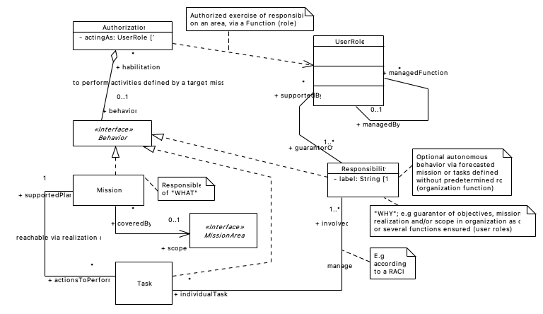

## PURPOSE
Presentation of the feature module design according to a domain-driven design structure.
The version of each diagram shown in this area is the latest produced via the source file.

# UI LAYER

# APPLICATION LAYER

## AccessControlContextImpl

# DOMAIN LAYER

## Authorization

## Identity

## Mission

## RACIMatrix

## Responsibility

## UserRole

# INFRASTRUCTURE LAYER