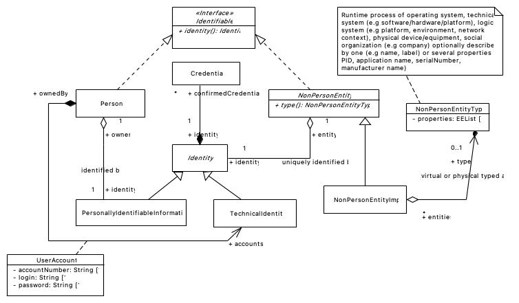
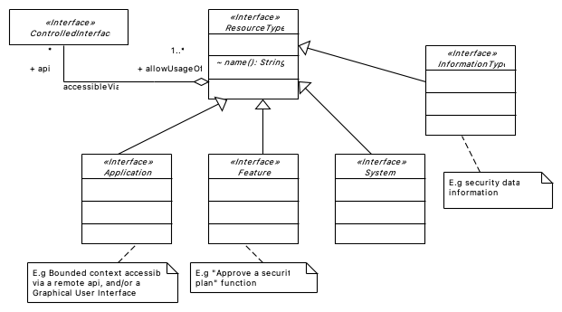

## PURPOSE
Presentation of the common element (e.g used by several modules).
The version of each diagram shown in this area is the latest produced via the source file.

# FRAMEWORK
Several sub-projects are managed to support frameworked concepts:

- [Immutable java library project](/implementations-line/framework/immutable): all concepts allowing implementation of immutability requirements supported by the `org.cybnity.framework.immutable` package.

# COMMON
### Identifiable

### ResourceType

#
[Back To Parent](../)
