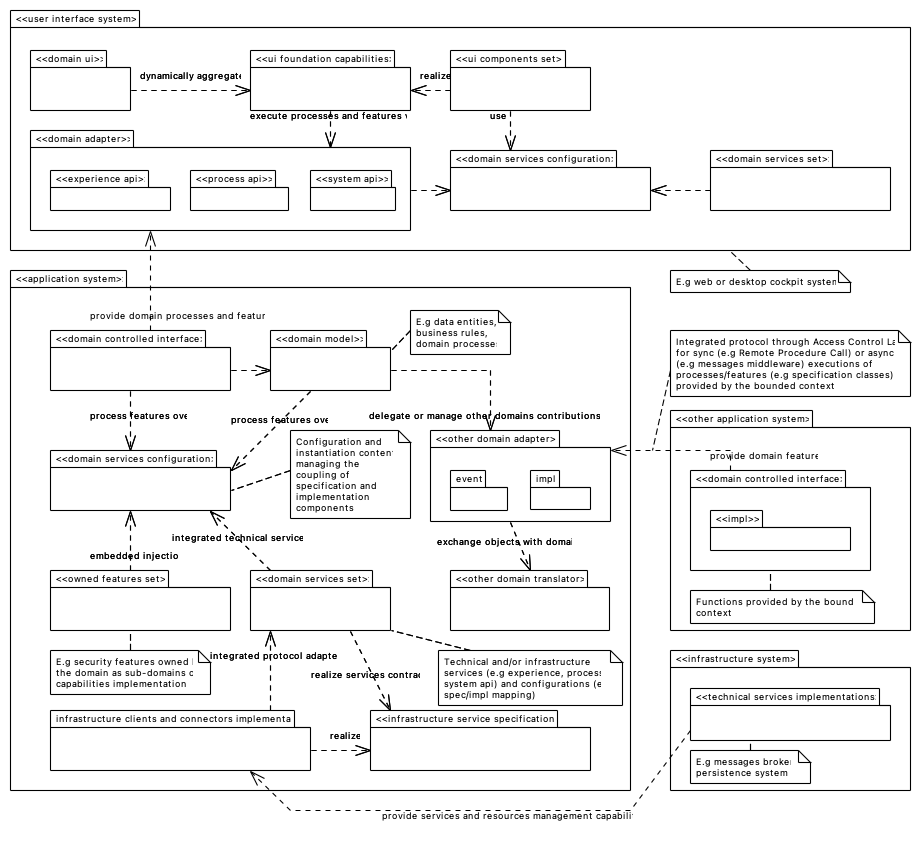
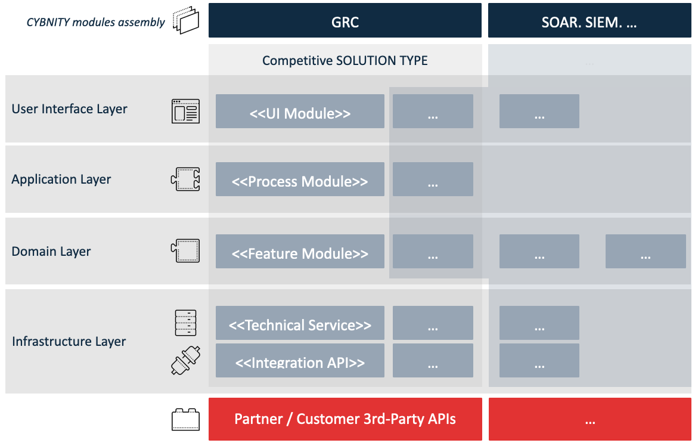
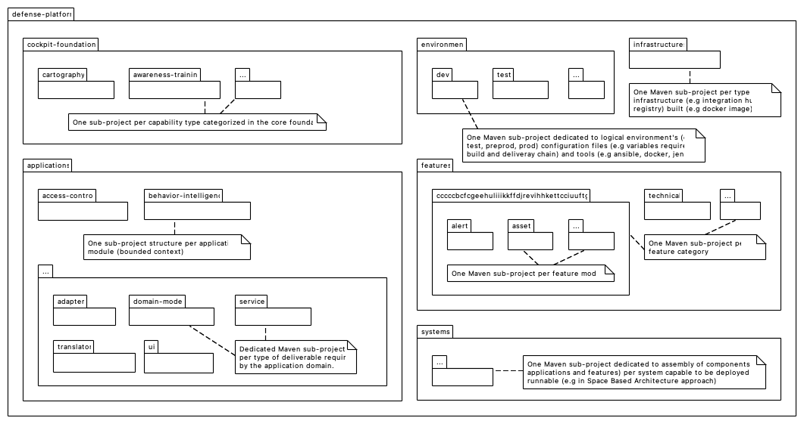

## PURPOSE
Presentation of the implementation view regarding each layer (e.g user interface, application, domain, infrastructure) and technical structures supporting the design models.
The version of each diagram shown in this area is the latest produced via the source file (Implementation view).

Identify here the main guidelines and principles of implementation that are framing the implementation tactics (e.g distribution of codes, configuration via packaging model) and that help selection of implementation frameworks (e.g for dependencies injection, UI layer kit implementation, coupling of service components) according to a Domain-Driven Development approach.

# MODULARITY PRINCIPLES
Presentation of the implementation principles respected by the CYBNITY technical designers, developers and packaging managers.

## APPLICATION PACKAGING
The packaging of technical and business components is framed according to dependencies and embedding principles.

### Solution Assembly
The assembly of specific modules can be customized for delivery of a business solution (e.g alternative to a proprietary applicative solution covering only a specific security domain).

# ASSEMBLY GUIDELINES

### Packaged Components Projects
The Java components projects are organized via a structure of Maven project's sub-modules regarding all the source codes developed, and are packaged as applicative components (.jar artifacts).

The standalone execution of .jar application is possible on standard Java Runtime Environment (e.g into a JVM installed on a developer's workstation, or since Java IDE tool).

### Application Modules Projects
The packaged applicative components (.jar) are assembled into autonomous Docker images, ready for execution into virtualized environments.

The containerized applicative modules (as CYBNITY deployable and executable systems) are organized via a [structure of containerized java application](/implementations-line/systems/README.md#standard-structure-of-a-containerized-java-application).

### Infrastructure Modules Projects
Some additional infrastructure systems (e.g complementary applications integrated with CYBNITY application modules) are packaged to be deployable into a safe infrastructure (e.g cloudified platform).

Infrastructure modules are Terraformed (regarding the CYBNITY deployable and executable infrastructure components) and organized via a [structure of modules project](/implementations-line/systems/README.md#standard-structure-of-modules-project).

# CODING GUIDELINES
Several coding documentations are available into the [how-to sub-directory](how-to) for assistance to developers.

The CYBNITY coding norms are considered like mandatory to apply and can be controlled via quality check process (e.g by Continuous Integration chain, source code reviews) and are origins for reject of source codes changes considered like violation of the documentation norm.

The CYBNITY conventions are more permissive because are considered as optional, without mandatory quality check (based on the developer motivation and skills), but can be transformed in norm after a period of application.

## CONVENTIONS
- [Coding conventions](how-to/coding-conventions.md)

## NORMS
- Branch tagging norm

#
[Back To Parent](../)
