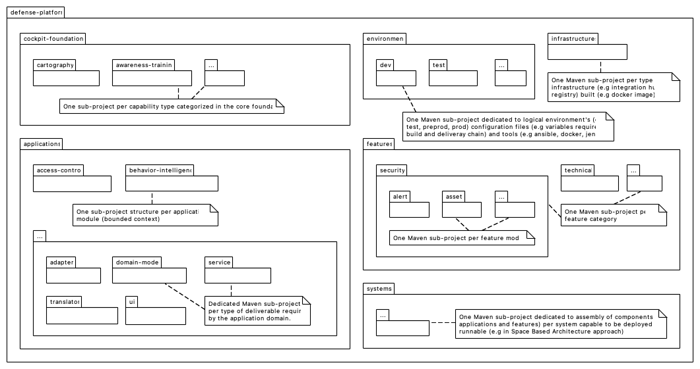

## PURPOSE
Presentation of the implementation view regarding each layer (e.g user interface, application, domain, infrastructure) and technical structures supporting the design models.
The version of each diagram shown in this area is the latest produced via the source file (Implementation view).

# GUIDELINES & PRINCIPLES
Identify the guidelines and principles of implementation that are framing the implementation tactics (e.g distribution of codes, configuration via packaging model) and that help selection of implementation frameworks (e.g for dependencies injection, UI layer kit implementation, coupling of service components) according to a Domain-Driven Development approach.

## PRINCIPLES
Definition of the implementation principles respected by the CYBNITY technical designers and developers.

### Application Packaging
The packaging of technical and business components is framed according to dependencies and embedding principles.

## GUIDELINES

### Source Code Projects Structure
The CYBNITY open source is organized via a structure of Maven project's sub-modules regarding all the source codes developed by the team.

[Back To Parent](../)