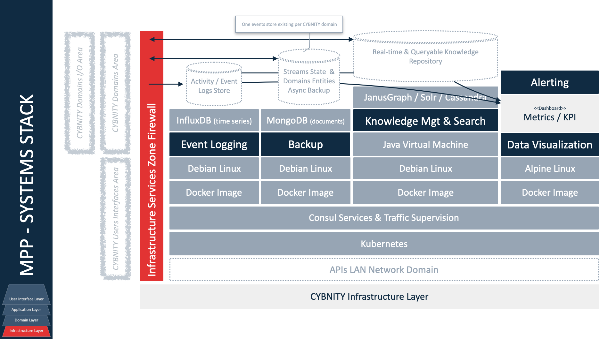

## PURPOSE
Presentation of the Foundation production project line dedicated to build and deliver CYBNITY specification and implementation components versions.

Feature specifications API versions (e.g interface versions) are delivered according to requirements and specification identified by MVF project line's prototyping results.

Feature implementations versions are designed and delivered as official Foundation Core implementation software.

### Sources Structure
Implementation components are built via Maven tool using a [standard Maven project structure](https://maven.apache.org/guides/introduction/introduction-to-the-standard-directory-layout.html).

The implementation projects are supported by an [Official TechStack version](https://github.com/cybnity/foundation-techstack/blob/feature-157/demonstrators-line/demonstrator-v0/v0-technologies-stack.md) defining the authorized technologies used by any the software sub-project.

# COCKPIT-FOUNDATION COMPONENTS
The source code managed in this area of Foundation project are about the capabilities provided to the users (e.g web ui services provided to user's web browser) via the user interface layer.

The implementation source codes realizes interactive functions provided by **UI Modules** (UI layer providing functional or technical capabilities) to deliver User eXperiences (UX) to the solution final users of CYBNITY solutions.

- Actions & Scheduling UI module
- Assets & Perimeters Protection UI module
- Automation UI module
- Awareness & Training UI module
- Behaviours/Situations Anticipation & Control UI module
- Commandment UI module
- Coordinations UI module
- Defensive Maneuvers UI module
- Defensive Responses & Controls UI module
- Goals & Evidences UI module
- ISMS & Strategy UI module
- Missions & Programming UI module
- Operational Excellence UI module
- Operational Recovery UI module
- Operations Cartography UI module
- SKPI & Dashboard UI module
- Stakeholders & Responsibilities UI module
- Standards & Compliances UI module
- Threat/Risks Prevention & Treatment UI module
- Vulnerabilities Prevention & Treatment UI module

Some shared deployable modules (e. endpoints) are also implemented at the UI layer level:
- [Web Reactive Frontend server](cockpit-foundations/web-reactive-frontend) (ReactJS / Node.js web app)
- [Reactive Messaging Gateway](cockpit-foundations/reactive-messaging-gateway) (Vert.x Reactive Backend server)

# APPLICATION COMPONENTS
The source codes managed in this independent projects are dedicated to each CYBNITY applicative domain.
Each application module dedicated repository manages its source codes structure via repositories with prefix "domain-":
- [Access Control module](https://github.com/cybnity/domain-access-control)
- [API Management module](https://github.com/cybnity/domain-api-mgt)
- [Asset Control module](https://github.com/cybnity/domain-asset-control)
- [Audit Management module](https://github.com/cybnity/domain-audit-mgt)
- [Awareness & Culture Management module](https://github.com/cybnity/domain-awareness-mgt)
- [Behavior Intelligence module](https://github.com/cybnity/domain-behavior-intelligence)
- [Compliance & Certification Management module](https://github.com/cybnity/domain-compliance-mgt)
- [Detection Intelligence module](https://github.com/cybnity/domain-detection-intelligence)
- [Governance Management module](https://github.com/cybnity/domain-governance-mgt)
- [Posture & Prevention Management module](https://github.com/cybnity/domain-posture-prevention-mgt)
- [Quality Management module](https://github.com/cybnity/domain-quality-mgt)
- [Response Management module](https://github.com/cybnity/domain-response-mgt)
- [Risk Management module](https://github.com/cybnity/domain-risk-mgt)
- [Security Event Management module](https://github.com/cybnity/domain-security-event-mgt)
- [Threat Intelligence module](https://github.com/cybnity/domain-threat-intelligence)
- [Trial & Training Management module](https://github.com/cybnity/domain-trial-training-mgt)
- [Vulnerability Management module](https://github.com/cybnity/domain-vulnerability-mgt)

Each application domain distributed into the Application Layer aggregates deployable implementation components:
- One <<Domain Name>> **Gateway Module** (messaging gateway as endpoint of the bounded context)
- Several deployable **Process Modules**

# FEATURE COMPONENTS
The features implementation modules providing services which can be embedded by an application domain and/or can be exposed as reusable/common/shared function at one or several layers of the CYBNITY software.

The implementation source codes mainly are **Java libraries** which can be reused.

For example, a common feature library can be embedded into an application domain or can be independently deployed as a micro-service serving several application domain (e.g as a cluster of a specific technical feature instances).

Several categories of features are implemented through Java libraries regarding:
- domain: libraries of cyber-serenity features helping final user to manage its ISMS via processes, workflow, combined set of application feature integrated into the UI capability components
- integrated-partners: features provided by CYBNITY compatible partners' components (e.g accessory) and adapted via compatibility connectors
- operating-system: technical features provided by operating systems (e.g hypervisor, virtualization component)
- physical: features provided by physical devices integrated
- technical: features providing technical services (e.g strongbox, traceability, versioning, encryption) and implementing reusable functions by any CYBNITY component
- transport: features relative to communication layer between systems and/or application components (e.g firewalling, network monitoring)
- workflow-process: features providing generic workflow and processes management implementation models

### Domain Layer
Each application domain can more or less separate its features in micro-services as deployable **Feature Modules** to manage the processing parallelization via Real-Time Stream Computation Units.

### Runtime Model of Feature Components
The scalability required by a specific feature component is supported by the implementation of a runtime model that include the deployment of a set of micro-service instances regarding it.

# INFRASTRUCTURE COMPONENTS
The source code managed in this area are about the infrastructure components supporting the features and applications modules.
For example, the implementation source code of an adapter client to a monitoring server (e.g proprietary solution integrated with CYBNITY over a connection adapter and/or via a protocol compatibility implementation) is provided as an infrastructure module.
Mainly, the **Infrastructure Modules** are provided as **Java libraries** of adaptation client implementations modules.

Several categories of infrastructure technologies are managed in terms of implementation codes:
- common: shared and transversal structures of infrastructure data (e.g generic event)
- continuity: clients of integration with Business Continuity systems
- integration: clients with brokers of messages (e.g Redis cluster, Kafka broker) allowing to discuss with other CYBNITY or third-parties systems
  - Users Interactions Space server
- monitoring: clients to systems of monitoring (e.g alerting, data visualization, event logging)
- registry: clients to registration systems (e.g contents indexing system)
- security: clients to systems providing security services (e.g Single-Sign-On server, IAM server)
  - Access Control & SSO server
  - Identities & Access Management server

Any implementation component can be categorized as a **Technical Service** (implementation code executing a behavior, or implementation of a system client as adapter implementation module) or as a **Integration API** (when exposing a CYBNITY API exposed to other systems as an input/output point via a standardized protocol).

### Shared Infrastructure Services
For example, the infrastructure implementation modules allow to manage the dependency with common systems reused (e.g based on open source and/or proprietary partners software instances) into a CYBNITY solution architecture deployment.

### Common Transversal Components
Example of common event-based principles using a common infrastructure library regarding generic event.

