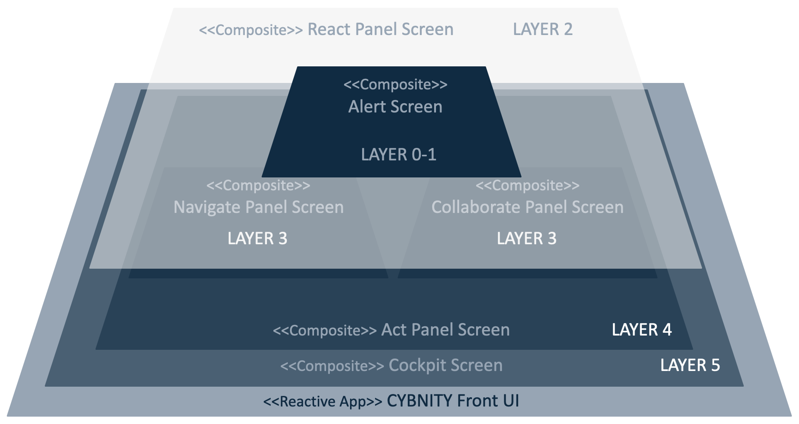
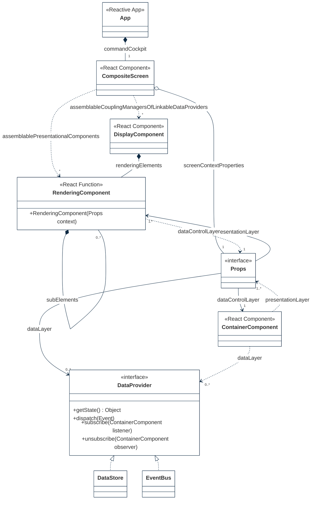
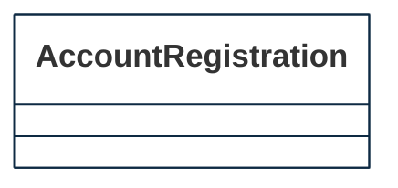

## PURPOSE
Presentation of the design view regarding the sub-packages of `web-reactive-frontend` project since its `src` folder.

# DESIGN VIEW
The technical description regarding behavior and best usage is maintained into the Javadoc of each component.

| Component Type     | Motivation                                                                                                                                                                                                                                                                                                                      |
|:-------------------|:--------------------------------------------------------------------------------------------------------------------------------------------------------------------------------------------------------------------------------------------------------------------------------------------------------------------------------|
| App                | Application view including the global configuration of a React JS single-page web application including viewport sub-elements                                                                                                                                                                                                   |
| CompositeScreen    | React component assembling several display components with presentational components that defined a CYBNITY cockpit's screen (e.g perspective)                                                                                                                                                                                  |
| ContainerComponent | Statefull React component that manage a screen state changes (e.g client-side data with reducer() capability), the data to render and the behavior logical of a screen; listener of presentational components' action published in store                                                                                        |                                                                   |
| DataProvider       | Client-side data provider managing data states regarding one (e.g display view) or several contexts (e.g composite screen sharing data between multiple sub-elements of presentation                                                                                                                                            |
| DataStore          | Local data store managing data (e.g local shared data between presentation and control elements) or read  model of remote data provider(s)                                                                                                                                                                                      |
| DisplayComponent   | React component that control the behavior of sub-components (e.g perspective internal views; sub-elements of a screen) and presentational sub-elements (e.g buttons); ensure rendering of the presentation components; manage low coupling between a container and it's presentational components                               |
| EventBus           | Backend proxy (e.g in/out channels bus) allowing interactions with remote data layer (e.g server-side services provided as domain capabilities) to dispatch user's change intents (e.g command events) and/or to receive remote data layer changed status (e.g collect of data status to upgrade into a client-side data store) |
| Props              | Configuration of properties linking rendering component references and container component references in a low coupling approach                                                                                                                                                                                                |
| RenderingComponent | Stateless React function which ensure the HTML rendering into a web browser, and that ensure push of intent events (e.g as actions) to store (e.g over changes into the linked Store through assigned ContainerComponent); it's an eligible element to composite instantiation                                                  |                                                                                                                                                                                                                                                                       

# STRUCTURE MODELS
Several packages are implemented to organize the components (e.g specification elements, implementation components) required by each application module (e.g according to its application domain).

## COMPONENTS PACKAGE
Several types of common reactive elements are defined included as enabler and utilities components which are reusable into any feature module.
The sub-packages are organized by type of components.

### Security sub-package
Include components used in secured area.

| Component Type | Motivation |
|:---------------|:-----------|
|                |            |

### Services sub-package

| Component Type | Motivation |
|:---------------|:-----------|
|                |            |

## FEATURES PACKAGE
The sub-packages are organized by capability/feature module.

### Cockpits sub-package
Include cockpit composite elements and sub-elements defining systems of operational cockpits.
See [concept documentation](https://cybnity.notion.site/CYBNITY-System-Of-Operational-Cockpits-3bc187d32bb947e0a73aaceb998a42ab?pvs=4) for more detail.

| Component Type                | Motivation                                                                                                                                            |
|:------------------------------|:------------------------------------------------------------------------------------------------------------------------------------------------------|
| ActPanelScreenDisplay         | Information or process management view (e.g actions plan, asset detail)                                                                               |
| AlertScreenDisplay            | Alerting view (e.g urgent decision modal view) suspending user's current activity for immediate action(s)                                             |
| CockpitScreen                 | Dynamic configured composite screen materializing the user cockpit according to his organization role and to the current organization's Infocon level |
| CollaboratePanelScreenDisplay | Instant collaboration panel (e.g group chat, team video live) with other team members                                                                 |
| Infocon5CockpitScreenDisplay  | Operational performance monitoring cockpit                                                                                                            |
| Infocon4CockpitScreenDisplay  | Risk of attack operational cockpit                                                                                                                    |
| Infocon3CockpitScreenDisplay  | Increased alertness & security review cockpit                                                                                                         |
| Infocon2CockpitScreenDisplay  | Ready to cyber fight cockpit                                                                                                                          |
| Infocon1CockpitScreenDisplay  | Offensive immediate response cockpit                                                                                                                  |
| NavigatePanelScreenDisplay    | Search of information, missions, topics and sections of contents (e.g user's role/mission based) allowing to navigate into ISMS                       |
| ReactPanelScreenDisplay       | Urgency actions command panel (e.g team mobilization, intercom, BCP/DRP start)                                                                        |
| SituationPanelScreenDisplay   | Environment metrics and situation indicators panel (e.g asset status, risk level, intervention team status) according to a time range zoom            |

```mermaid
%%{
  init: {
    'theme': 'base',
    'themeVariables': {
        'background': '#ffffff',
        'fontFamily': 'arial',
        'fontSize': '18px',
        'primaryColor': '#fff',
        'primaryBorderColor': '#0e2a43',
        'secondaryBorderColor': '#0e2a43',
        'tertiaryBorderColor': '#0e2a43',
        'edgeLabelBackground':'#0e2a43',
        'lineColor': '#0e2a43',
        'tertiaryColor': '#fff'
    }
  }
}%%
classDiagram
    CollaboratePanelScreenDisplay ..> "0..*" AlertScreenDisplay
    ActPanelScreenDisplay o-- "1" NavigatePanelScreenDisplay :navigate
    ActPanelScreenDisplay ..> "0..*" AlertScreenDisplay
    ActPanelScreenDisplay o-- "1" CollaboratePanelScreenDisplay :collaborate
    ActPanelScreenDisplay "1..*" <-- Infocon5CockpitScreenDisplay :act
    Infocon5CockpitScreenDisplay ..> "0..*" AlertScreenDisplay
    ActPanelScreenDisplay "1..*" <-- Infocon4CockpitScreenDisplay :act
    Infocon4CockpitScreenDisplay ..> "0..*" AlertScreenDisplay
    ActPanelScreenDisplay "1..*" <-- Infocon3CockpitScreenDisplay :act
    Infocon3CockpitScreenDisplay ..> "0..*" AlertScreenDisplay
    ActPanelScreenDisplay "1..*" <-- Infocon2CockpitScreenDisplay :act
    Infocon2CockpitScreenDisplay ..> "0..*" AlertScreenDisplay
    ActPanelScreenDisplay "1..*" <-- Infocon1CockpitScreenDisplay :act
    Infocon1CockpitScreenDisplay ..> "0..*" AlertScreenDisplay
    ReactPanelScreenDisplay ..> "0..*" AlertScreenDisplay
    SituationPanelScreenDisplay ..> "0..*" AlertScreenDisplay
    CockpitScreen "1" ..> "0..1" Infocon5CockpitScreenDisplay :activeScreenManager
    CockpitScreen "1" ..> "0..1" Infocon4CockpitScreenDisplay :activeScreenManager
    CockpitScreen "1" ..> "0..1" Infocon3CockpitScreenDisplay :activeScreenManager
    CockpitScreen "1" ..> "0..1" Infocon2CockpitScreenDisplay :activeScreenManager
    CockpitScreen "1" ..> "0..1" Infocon1CockpitScreenDisplay :activeScreenManager
    
    class Infocon5CockpitScreenDisplay {
        <<DisplayComponent>>
        -reactView : ReactPanelScreenDisplay
    }
    class Infocon4CockpitScreenDisplay {
        <<DisplayComponent>>
        -reactView : ReactPanelScreenDisplay
    }
    class Infocon3CockpitScreenDisplay {
        <<DisplayComponent>>
        -reactView : ReactPanelScreenDisplay
    }
    class Infocon2CockpitScreenDisplay {
        <<DisplayComponent>>
        -reactView : ReactPanelScreenDisplay
    }
    class Infocon1CockpitScreenDisplay {
        <<DisplayComponent>>
        -reactView : ReactPanelScreenDisplay
    }
    class ReactPanelScreenDisplay {
        <<DisplayComponent>>
    }
    class SituationPanelScreenDisplay {
        <<DisplayComponent>>
        -reactView : ReactPanelScreenDisplay
    }
    class ActPanelScreenDisplay {
        <<DisplayComponent>>
    }
    class NavigatePanelScreenDisplay {
        <<DisplayComponent>>
    }
    class AlertScreenDisplay {
        <<DisplayComponent>>
    }
    class CollaboratePanelScreenDisplay {
        <<DisplayComponent>>
    }
    class CockpitScreen {
        <<CompositeScreen>>
        -screenContextProperties : Props
    }
    
```

### Access-control sub-package
Capability providers required by the UI layer of the access-control domain module.

| Component Type      | Motivation |
|:--------------------|:-----------|
| AccountRegistration |            |

#
[Back To Home](../README.md)
