## PURPOSE
Presentation of an example of the library usage to code a domain aggregate read-model (data-view projections) via extension (e.g simulating a coding of a specific domain repository).

# DESIGN VIEW
The sample classes developed as example are available into the `test/java/org/cybnity/infrastructure/technical/registry/repository/impl/janusgraph/sample` sub-folder.

The `test/java/org/cybnity/infrastructure/technical/registry/repository/impl/janusgraph/DomainTransactionsRepositoryUseCaseTest.java` test component includes a unit test validating the good behavior of the example of domain repository.

### Key Components
The key implemented components are:
- A domain repository (e.g SampleDomainTransactionsRepository)
- A read-model perimeter (e.g SampleDomainReadModelImpl) as set of data-view projections managed by a domain repository (that can manage one or multiple read-models over several graph models)
- A set of transaction components (e.g SampleDataViewStateTransactionImpl) implementing specific operations and queries relative to a Domain Aggregate (e.g aggregate object managed in a store by an application that need to expose a read-model version of its denormalized data views)
    - 2 data view transactions (CreateSampleDataViewVersion, UpgradeSampleDataViewVersion) ensuring specific modifications of a data-view status of a read-model projection state, according to evolution of an aggregate detected from its change events notifications
    - 1 data view query transaction (FindSampleDataViewVersionByEqualsLabel) providing read capability (from explicit Query command) of the read-model projection into JanusGraph and Gremlin traversal query language

For more detail, the technical description regarding behavior and best usage is maintained into the Javadoc of each component.

| Class Type                              | Motivation                                                            |
|:----------------------------------------|:----------------------------------------------------------------------|
| DomainTransactionsRepositoryUseCaseTest | Test of implemented repository relative to a perimeter of projections |

## STRUCTURE MODELS
Presentation of the design view of the `org.cybnity.infrastructure.technical.registry.repository.impl.janusgraph.sample` sample project's artifacts package.

The dissemination of implementation classes is respecting a standard distribution defined by CYBNITY domain framework guideline relative to organization of source codes.

### Infrastructure.impl sub-package

| Class Type                         | Motivation                                                                                                                                                                                                      |
|:-----------------------------------|:----------------------------------------------------------------------------------------------------------------------------------------------------------------------------------------------------------------|
| ISampleDomainRepository            | Example of repository read-model perimeter providing business methods                                                                                                                                           |
| SampleDomainTransactionsRepository | Example of domain repository managing transactions relative to an object type (e.g supported by one or several read-model projections representing it and its relations scope) or to a domain or to a subdomain |

### Infrastructure.impl.projections sub-package

| Class Type                         | Motivation                                                                                                                                                                                                  |
|:-----------------------------------|:------------------------------------------------------------------------------------------------------------------------------------------------------------------------------------------------------------|
| SampleDataViewStateTransactionImpl | Example of domain aggregate view (domain object data view projected) supporting a SampleDataView vertex type's lifecycle (e.g creation, upgrade/refresh, enhancement, remove) via transactions onto a graph |
| SampleDomainGraphImpl              | Example of graph covering the Access Control domain and scope of Vertex types managed in this area (e.g Tenants, in relation with other subdomains)                                                         |
| SampleDomainReadModelImpl          | Example of projections collection relative to a domain perimeter (e.g Access Control) or to a specific domain object type (e.g a domain aggregate)                                                          |

### Infrastructure.impl.projections.change sub-package

| Class Type                   | Motivation                                                                                                                                                                                                                                  |
|:-----------------------------|:--------------------------------------------------------------------------------------------------------------------------------------------------------------------------------------------------------------------------------------------|
| CreateSampleDataViewVersion  | Example of utility class implementing the Query Language supported by the graph model (e.g Gremlin with TinkerPop) for execution of a change directive. Implementation about DomainEventType.SAMPLE_AGGREGATE_CREATED domain event type  |
| SampleDataViewMapper         | Example of DTO mapping implementation class ensuring the preparation of a data view version                                                                                                                                                 |
| UpgradeSampleDataViewVersion | Example of utility class implementing the Query Language supported by the graph model (e.g Gremlin with TinkerPop) for execution of a change directive. >Implementation about DomainEventType.SAMPLE_AGGREGATE_CHANGED domain event type |

### Infrastructure.impl.projections.read sub-package

| Class Type                             | Motivation                                                                                                                                                                                                                                              |
|:---------------------------------------|:--------------------------------------------------------------------------------------------------------------------------------------------------------------------------------------------------------------------------------------------------------|
| FindSampleDataViewVersionByEqualsLabel | Example of utility class implementing the Query Language supported by the graph model (e.g Gremlin with TinkerPop) for execution of a query directive. Implementation about DomainEventType.SAMPLE_AGGREGATE_FIND_BY_LABEL domain query command type |

### Service.api sub-package

| Class Type   | Motivation                       |
|:-------------|:---------------------------------|
| SampleDomain | Example of an application domain |

### Service.api.model sub-package

| Class Type     | Motivation                                                                          |
|:---------------|:------------------------------------------------------------------------------------|
| SampleDataView | Example of data view representing a transaction managed by a read model of a domain |

### Service.api.event sub-package

| Class Type                 | Motivation                                                  |
|:---------------------------|:------------------------------------------------------------|
| SampleDomainEventType      | Example of event type supported by the SampleDomain         |
| SampleDomainQueryEventType | Example of query command type supported by the SampleDomain |

```mermaid
%%{
  init: {
    'theme': 'base',
    'themeVariables': {
        'background': '#ffffff',
        'fontFamily': 'arial',
        'fontSize': '18px',
        'primaryColor': '#fff',
        'primaryBorderColor': '#0e2a43',
        'secondaryBorderColor': '#0e2a43',
        'tertiaryBorderColor': '#0e2a43',
        'edgeLabelBackground':'#0e2a43',
        'lineColor': '#0e2a43',
        'tertiaryColor': '#fff'
    }
  }
}%%
classDiagram
    AbstractReadModelRepository <|-- SampleDomainTransactionsRepository
    ISampleDomainRepository <|.. SampleDomainTransactionsRepository
    SampleDomainTransactionsRepository *-- "1" SampleDomainReadModelImpl : managedProjections
    SampleDomainTransactionsRepository *-- "1" SampleDomainGraphImpl : graphModel
    SampleDomainReadModelImpl *-- "1" SampleDataViewStateTransactionImpl
    note for CreateSampleDataViewVersion "Interpret creation event notified by domain write-model, and add data-view version into the manipulated graph"
    
    SampleDataViewStateTransactionImpl ..> CreateSampleDataViewVersion : supportedTransactions item
    SampleDataViewStateTransactionImpl ..> UpgradeSampleDataViewVersion : supportedTransactions item
    SampleDataViewStateTransactionImpl ..> FindSampleDataViewVersionByEqualsLabel : supportedQueries item
    CreateSampleDataViewVersion --> SampleDomainGraphImpl : graph
    CreateSampleDataViewVersion ..> SampleDataViewMapper : use
    UpgradeSampleDataViewVersion --> SampleDomainGraphImpl : graph
    FindSampleDataViewVersionByEqualsLabel --> SampleDomainGraphImpl : graph
    
    note for SampleDomainTransactionsRepository "Application domain repository responsible to provide a perimeter of up-to-date data views. It define/instantiate a set of projections identifying the read-model scope that can manipulate one or multiple dedicated domain graph"
    note for ISampleDomainRepository "Specific application domain repository interface exposing specialized sync read functions parallel to queries supported over CQRS pattern"
    note for SampleDomainReadModelImpl "Read-model projections perimeter specialized per application domain (or per domain's Aggregate). Define all usable projections as delegated actor of repository for a defined read-model scope"
    note for SampleDomainGraphImpl "Define JanusGraph storage backend configuration and manage all graph specific structure elements (Vertex, Edges, Indexes, Labels, Properties) that are static (e.g long-time structural constraints)"
    note for SampleDataViewStateTransactionImpl "Detect and interpret explicit query requests or domain event (e.g write-model change event handled), and ensure dispatching to the good transaction ensuring the graph change (read of state; change for alignment with domain aggregate last version state as data-view up-to-date)"
    note for UpgradeSampleDataViewVersion "Interpret any change event relative to the domain aggregate write-model, and update/refresh existing data-view projection with new value as last data-view version queryable"
    note for FindSampleDataViewVersionByEqualsLabel "Interpret and read query parameters of request about the aggregate data-view projection state, and return optimized data-view DTO version"
    
    class SampleDomainTransactionsRepository {
        -READ_MODEL_OWNERSHIP : SampleDomain$
        +queryWhere(Map~String, String~ searchCriteria, ISessionContext ctx) List~SampleDataView~
    }
    class SampleDomainReadModelImpl {
        <<AbstractReadModelProjectionsSet>>
        -domainProjections : LinkedHashSet~IReadModelProjection~
    }
    class ISampleDomainRepository {
    }
    class SampleDomainReadModelImpl {
    }
    class SampleDataViewStateTransactionImpl {
        <<AbstractGraphDataViewTransactionImpl>>
        -initSupportedTransactions()
        -initSupportedQueries()
        +handleEvent(DomainEvent evt)
        +when(Command command) IQueryResponse
    }
    class SampleDomainGraphImpl {
        <<AbstractDomainGraphImpl>>
        -GRAPH_NAME : String$
    }
    class CreateSampleDataViewVersion {
        <<AbstractDataViewVersionTransactionImpl>>
    }
    class UpgradeSampleDataViewVersion {
        <<AbstractDataViewVersionTransactionImpl>>
    }
    class FindSampleDataViewVersionByEqualsLabel {
        <<AbstractDataViewVersionTransactionImpl>>
    }
    class SampleDataViewMapper {
        <<AbstractDTOMapper>>
        +convertTo(Object source) SampleDataView
    }
```

#
[Back To Home](../README.md)
