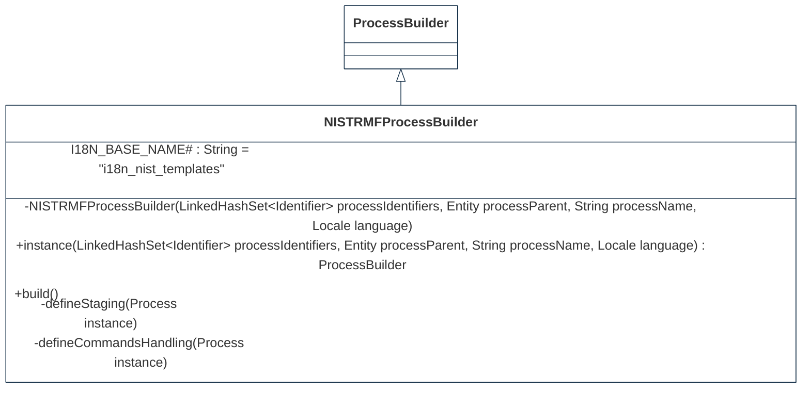

## PURPOSE
Presentation of the design view regarding the sub-packages of `org.cybnity.feature.defense_template` project.

# DESIGN VIEW
The technical description regarding behavior and best usage is maintained into the Javadoc of each component.

|Class Type|Motivation|
| :-- | :-- |
|NISTRMFProcessBuilder|Builder implementation class creating NIST RMF process instance that is customized (as template) according to the NIST RMF standard|
|ProcessBuildDirector|Responsible of coordination regarding the build of several types of processes|
|Referential|Basis implementation class of a referential|
|Template|Common definition class regarding a specification object which define a template (e.g process aggregate object)|

# STRUCTURE MODELS
Several packages are implemented to organize the components (e.g specification elements, implementation components) additionnaly to these provided by this package.

## DOMAIN.MODEL PACKAGE

```mermaid
%%{
  init: {
    'theme': 'base',
    'themeVariables': {
        'background': '#ffffff',
        'fontFamily': 'arial',
        'fontSize': '18px',
        'primaryColor': '#fff',
        'primaryBorderColor': '#0e2a43',
        'secondaryBorderColor': '#0e2a43',
        'tertiaryBorderColor': '#0e2a43',
        'edgeLabelBackground':'#0e2a43',
        'lineColor': '#0e2a43',
        'tertiaryColor': '#fff'
    }
  }
}%%
classDiagram
  ValueObject~String~ <|-- Referential
  IReferential <.. Referential
  Serializable <.. Referential
  IVersionable <.. Referential
  ITemplate <.. Template

  class Referential {
    <<ValueObject>>
    -acronym : String
    -label : String
  }

  class ProcessBuildDirector {
    +ProcessBuildDirector(IProcessBuilder builder)
    +change(IProcessBuilder builder)
    +make()
  }

  class Template {
    <<Aggregate>>
    -originReferential : IReferential
    -name : MutableAttribute
    -modelOf : DomainObjectType
    +Template(Entity predecessor, Identifier id, IReferential originReferential, String name,
			DomainObjectType modelOf)
    +Template(Entity predecessor, LinkedHashSet~Identifier~ identifiers, IReferential originReferential, String name,
			DomainObjectType modelOf)
    -Template(Entity predecessor, LinkedHashSet~Identifier~ identifiers, IReferential originReferential,
			MutableAttribute name, DomainObjectType modelOf)
    +originReferential() IReferential
    +named() MutableAttribute
    +name() String
    +type() DomainObjectType
  }

```

## DOMAIN.MODEL.NIST PACKAGE

### Process sub-package

### Process Life Cycle

```mermaid
%%{
  init: {
    'theme': 'base',
    'themeVariables': {
        'background': '#ffffff',
        'fontFamily': 'arial',
        'fontSize': '18px',
        'primaryColor': '#fff',
        'primaryBorderColor': '#0e2a43',
        'secondaryBorderColor': '#0e2a43',
        'tertiaryBorderColor': '#0e2a43',
        'edgeLabelBackground':'#0e2a43',
        'lineColor': '#0e2a43',
        'tertiaryColor': '#fff'
    }
  }
}%%
stateDiagram
	[*] --> Process

	state Process {
		[*] --> Prepare
		note left of Prepare
			name = "Prepare"
			type = "Step"
			<br>
		end note

		state Prepare {
			RiskAssessmentOrganization
			CommonControlIdentification
			note left of CommonControlIdentification
				name = "CommonControlIdentification"
				type = "Step"
				properties = { OrganizationLevel }
				<br>
			end note
			state "..." as MissionOrBusinessFocus
		}
		Prepare --> Categorize : next
		Prepare --> Select : next

		note left of Select
			name = "Select"
			type = "Step"
			<br>
		end note
		Prepare --> Implement: next
		note left of Implement
			name = "Implement"
			type = "Step"
			<br>
		end note
		Prepare --> Assess : next
		Categorize --> Select : next
		note left of Categorize
			name = "Categorize"
			type = "Step"
			<br>
		end note
		Select --> Implement : next
		Implement --> Assess : next
		note left of Assess
			name = "Assess"
			type = "Step"
			<br>
		end note
		Assess --> Authorize : next
		Prepare --> Authorize : next
		Authorize --> Monitor : next
		note left of Monitor
			name = "Monitor"
			type = "Step"
			<br>
		end note
		note left of Authorize
			name = "Authorize"
			type = "Step"
			<br>
		end note
	}

```


#
[Back To Home](README.md)
