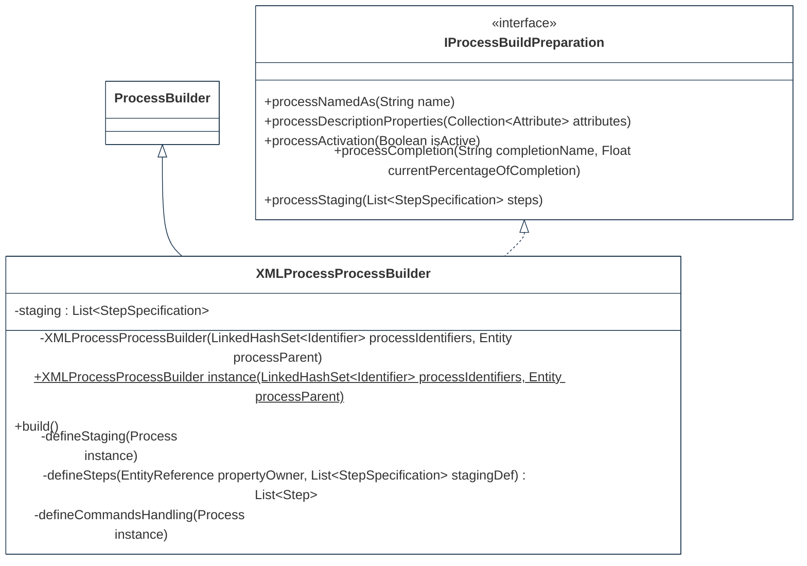
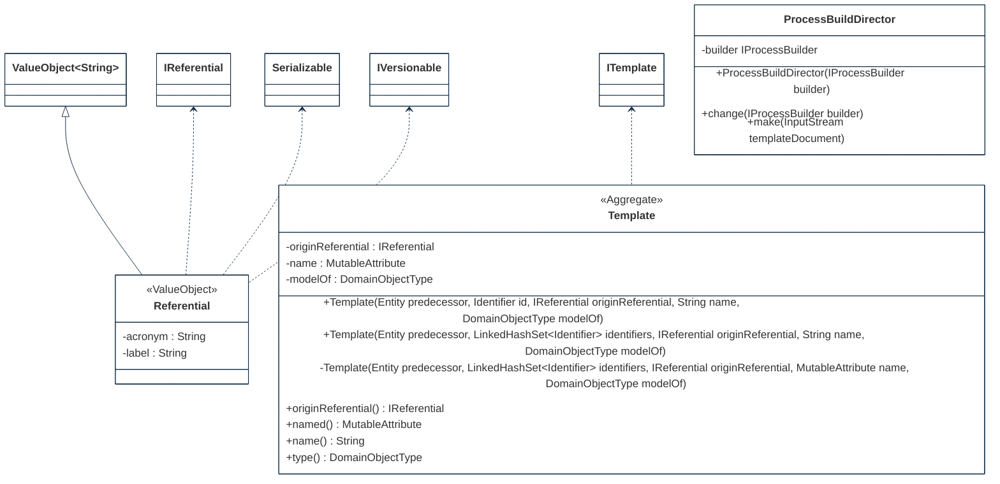

## PURPOSE
Presentation of the design view regarding the sub-packages of `org.cybnity.feature.defense_template` project.

# DESIGN VIEW
The technical description regarding behavior and best usage is maintained into the Javadoc of each component.

|Class Type|Motivation|
| :-- | :-- |
|IProcessBuildPreparation|Represent a observation contract of a template resource read, allowing to received found resource's contents as prepared value (e.g during an XML document parsing use by a process build director)|
|ProcessBuildDirector|Responsible of coordination regarding the build of several types of processes|
|ProcessTemplateXMLParser|DOM parsing implementation class of XML document defining a process template as specification reusable by a process builder to instantiate a customized process (e.g NIST RMF process)|
|Referential|Basis implementation class of a referential|
|Template|Common definition class regarding a specification object which define a template (e.g process aggregate object)|
|StepSpecification|Specification contents regarding a definition of process step. Container of informations allowing to collect values from a specification file (e.g XML document) and that can be extract for build of domain object instances|
|XMLProcessProcessBuilder|Builder implementation class creating a process instance that is based on an XML template (e.g XML document specifying the structure of a NIST RMF process)|

# STRUCTURE MODELS
Several packages are implemented to organize the components (e.g specification elements, implementation components) additionnaly to these provided by this package.

## SERVICE PACKAGE

## DOMAIN.MODEL PACKAGE

### RMF custom process Life Cycle
The templated process is defined by a specific life cycle respecting the NIST RMF specification (see [design documentation](risk-management-framework.md)).

```mermaid
%%{
  init: {
    'theme': 'base',
    'themeVariables': {
        'background': '#ffffff',
        'fontFamily': 'arial',
        'fontSize': '18px',
        'primaryColor': '#fff',
        'primaryBorderColor': '#0e2a43',
        'secondaryBorderColor': '#0e2a43',
        'tertiaryBorderColor': '#0e2a43',
        'edgeLabelBackground':'#0e2a43',
        'lineColor': '#0e2a43',
        'tertiaryColor': '#fff'
    }
  }
}%%
stateDiagram
	[*] --> Process

	state Process {
		[*] --> Prepare
		note left of Prepare
			name = "Prepare"
			type = "Step"
			<br>
		end note

		state Prepare {
			RiskAssessmentOrganization
			CommonControlIdentification
			note left of CommonControlIdentification
				name = "CommonControlIdentification"
				type = "Step"
				properties = { OrganizationLevel }
				<br>
			end note
			state "..." as MissionOrBusinessFocus
		}
		Prepare --> Categorize : next
		Prepare --> Select : next

		note left of Select
			name = "Select"
			type = "Step"
			<br>
		end note
		Prepare --> Implement: next
		note left of Implement
			name = "Implement"
			type = "Step"
			<br>
		end note
		Prepare --> Assess : next
		Categorize --> Select : next
		note left of Categorize
			name = "Categorize"
			type = "Step"
			<br>
		end note
		Select --> Implement : next
		Implement --> Assess : next
		note left of Assess
			name = "Assess"
			type = "Step"
			<br>
		end note
		Assess --> Authorize : next
		Prepare --> Authorize : next
		Authorize --> Monitor : next
		note left of Monitor
			name = "Monitor"
			type = "Step"
			<br>
		end note
		note left of Authorize
			name = "Authorize"
			type = "Step"
			<br>
		end note
	}

```

#
[Back To Home](README.md)
