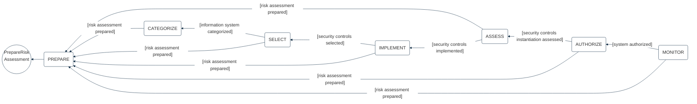
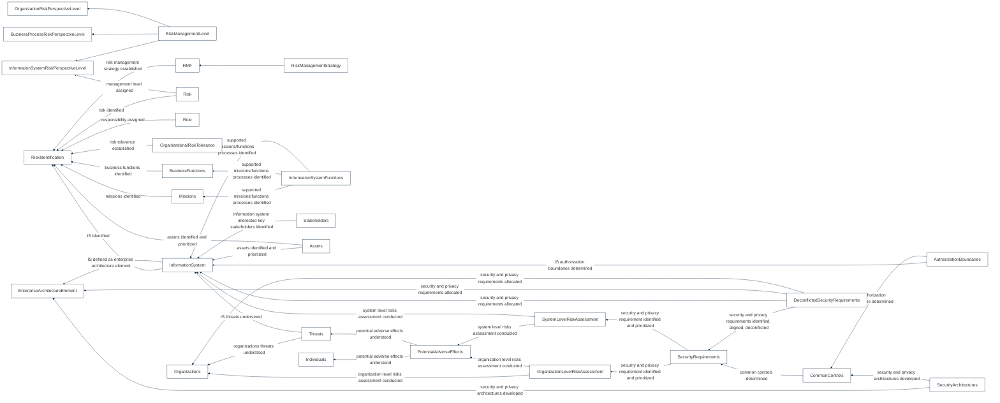

## PURPOSE
Presentation of the implementation model regarding the NIST Risk Management Framework (RMF) supported by the application domain.

# DESIGN VIEW
The process of risk management is delivered as a template for users managing the cybersecurity risks reusing the NIST RMF concerns, state machines, collaboration events configuring the standard data and classes definition.

## STRUCTURE MODELS
### Risk Management Template
Risk treatment workflow is templated according to the NIST RMF process.

The implementation model follow the Responsibility-Chain and Command design patterns as structure of each workflow step executed and generating events. See standard workflow design model for more detail.

The NIST risk management process includes several steps (e.g prepare, assess, categorize, implement, authorize, monitor) and sub-tasks organized according to event conditions thrown by the domain.

### Process and sub-tasks
Several sub-process that are responsible to produce deliverable during each process phase are existing and are optionnally constraints by other one.

Find here a presentation of the facts stream which define a moment into a NIST RMF standard risk assessment generating several interactions flow (materialized by domain events at end of tasks realization) when one or several risk entities that are created.

#### Risk assessment
Feature Type: make risk-based cybersecurity risk assessment of a scope

Requirements:
- [defined specification](https://www.notion.so/cybnity/Make-risk-based-cybersecurity-assessment-of-a-scope-43ab0ffd88624aa4af17862a57149b2b?pvs=4)
- and [REQ_FCT_73 by NIST](https://www.notion.so/cybnity/FCT_73_NIST-4c39f0929d724b4fb25954fdf9a1d052?pvs=4)

#
[Back To View](README.md)
