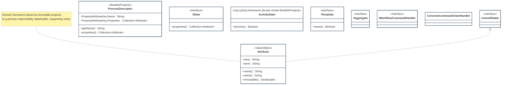

## PURPOSE
Presentation of the design view regarding the sub-packages of `org.cybnity.feature.security_activity_orchestration` project.

# DESIGN VIEW
The technical description regarding behavior and best usage is maintained into the Javadoc of each component.

|Class Type|Motivation|
| :-- | :-- |
|Attribute|Represent a characteristic which can be add to a topic (e.g a technical named attribute which is defined on-fly on an existing object, including a value). It's more or less like a generic property assignable to any topic or object (e.g property on a workflow step instance). For example, can be use to defined a tag regarding a property added to a
 * domain or aggregate object|
|IState|Represent a providing contract regarding the description of a state (e.g a process step) based on a collection of attributes|
|ProcessDescriptor|Definition regarding a process, that can be changed, and which need to be historized in an immutable way the history of changes (version of this information)|

# STRUCTURE MODELS
Several packages are implemented to organize the components (e.g specification elements, implementation components) additionnaly to these provided by this package.

## DOMAIN.MODEL PACKAGE

#
[Back To Home](README.md)
