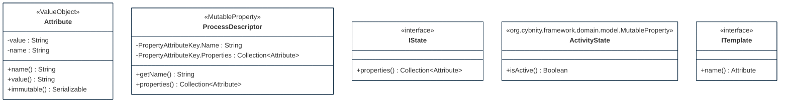

## PURPOSE
Presentation of the design view regarding the sub-packages of `org.cybnity.feature.security_activity_orchestration` project.

# DESIGN VIEW
The technical description regarding behavior and best usage is maintained into the Javadoc of each component.

|Class Type|Motivation|
| :-- | :-- |
|Attribute| |
|IState| |
|ProcessDescriptor| |

# STRUCTURE MODELS
Several packages are implemented to organize the components (e.g specification elements, implementation components) additionnaly to these provided by this package.

## domain.model package

#
[Back To Home](README.md)
