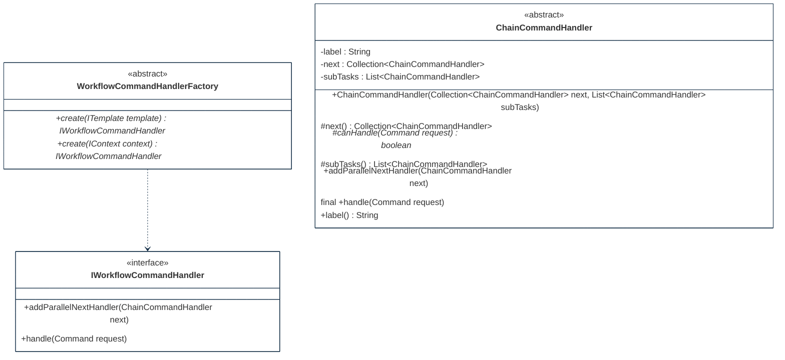

## PURPOSE
Presentation of the structural components regarding implementation architecture.

# DESIGN VIEW
Several structural patterns are supporting the orchestration capabilities.

### Key Components
For more detail, the technical description regarding behavior and best usage is maintained into the Javadoc of each component.

|Class Type|Motivation|
| :-- | :-- |
|ChainCommandHandler|Contract of command handling implementing the chain of responsibility chain pattern|
|IWorkflowCommandHandler|Chain of responsibility pattern implementation regarding the handling of workflow command events|
|WorkflowCommandHandlerFactory|Factory of handler. Can be based on a template file (e.g JSON, XML) of standard (e.g NIST, ISO27001). For example, factory is usable to define cyber-security framework including RMF process steps (and optional sub-tasks definitions) as ConcreteHandler definitions|

## STRUCTURE MODELS
Presentation of the design view of the `org.cybnity.feature.security_activity_orchestration` main project's artifacts package.

### Sub-Packages
See complementary presentation of [detailed structure models implemented into the sub-packages](designview-packages.md).

#
[Back To Home](README.md)
