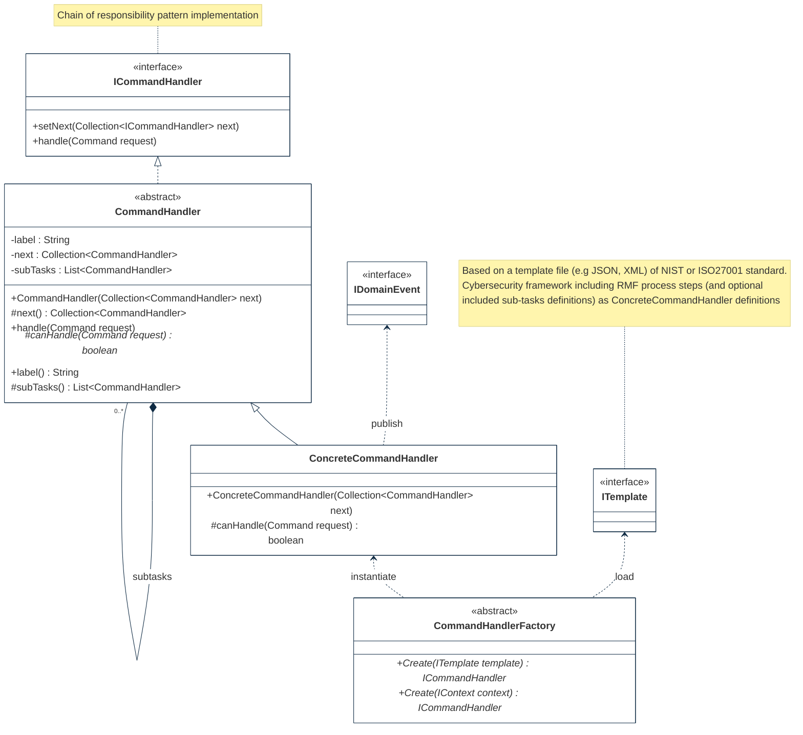

## PURPOSE
Presentation of the structural components regarding implementation architecture.

# DESIGN VIEW
Several structural patterns are supporting the orchestration capabilities.

### Key Components
For more detail, the technical description regarding behavior and best usage is maintained into the Javadoc of each component.

|Class Type|Motivation|
| :-- | :-- |
|CommandHandler| |
|CommandHandlerFactory| |
|ConcreteCommandHandler| |
|ICommandHandler| |
|ITemplate| |

## STRUCTURE MODELS
Presentation of the design view of the `org.cybnity.feature.security_activity_orchestration` main project's artifacts package.

### Sub-Packages
See complementary presentation of [detailed structure models implemented into the sub-packages](designview-packages.md).

#
[Back To Home](README.md)
