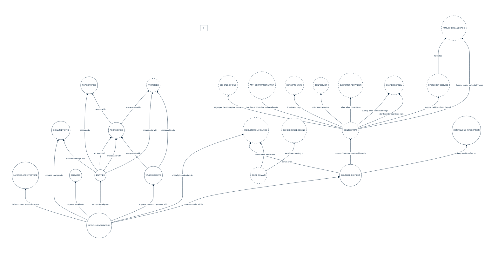

## PURPOSE
Presentation of the domain components regarding architecture components respecting the domain-driven design patterns.

# FUNCTIONAL VIEW
Presentation of the main functionalities area which allow realization of DDD requirements.

# DESIGN VIEW

- [Structure models presentation](designview-structure-models.md) that give an overview of some key components.
- [Sub-packages structure models](designview-packages.md) detailing specific sub-packages contents.

Several unit tests are implemented into the Maven project and propose examples of best usage of the framework domain elements (e.g for developer help who can reuse the library's elements).

# RELEASES HISTORY
- [V0 - FRAMEWORK changes list](v0-changes.md)

#
[Back To Home](../README.md)
