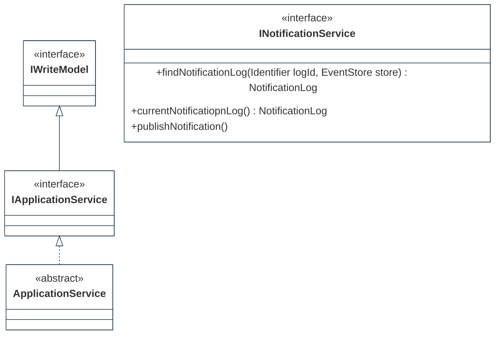
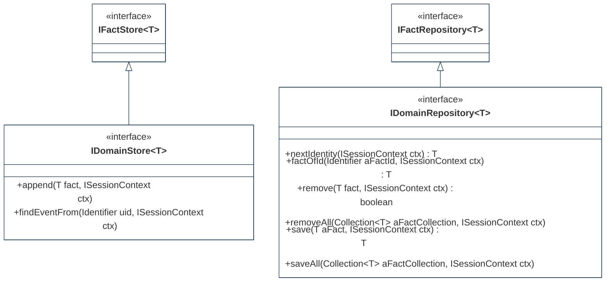

## PURPOSE
Presentation of the design view regarding the sub-packages of `org.cybnity.framework.domain` project.

# DESIGN VIEW
The technical description regarding behavior and best usage is maintained into the Javadoc of each component.

|Class Type|Motivation|
| :-- | :-- |
|ActivityState| |
|Aggregate|Scope of informations set which can be mutable (e.g domain entity aggregating value objects and/or entities reference), or immutable domain object (e.g entity reference)|
|ApplicationService| |
|CommandHandlingService|Represent a component which manage handlers regarding specific Aggregate type|
|CommonChildFactImpl|Reusable generic implementation class as child of immutable historical fact|
|DomainEntityImpl| |
|DomainEventPublisher|Publishing service from a domain model as repository service for Aggregates notifying their state changes|
|DomainEventSubscriber|Interest contract to be notified when types of facts are changed|
|EventRecord| |
|EventStore|Persistence system of event and aggregate types regarding a single bounded context|
|EventStream|Append-only nature stream of domain events in order of occurence regarding a domain object|
|IAggregate|Identifiable fact that defines a consistency boundary including multiple related objects (e.g domain and/or value objects)|
|IApplicationService|Applicative behaviors contract regarding an application layer|
|IAggregate|In a Domain-Driven Design (DDD), an aggregate defines a consistency boundary. An aggregate may consist of multiple related objects, all of which could be persisted together (e.g atomic operation)|
|IContext|Generic contact allowing to share and provide information in an area of usage|
|IDomainModel| |
|IDomainRepository| |
|IDomainStore| |
|IEventStore|Contract regarding storing (with append-only approach) and hydratation of a type of event (e.g versions stream)|
|INotificationService|Publishing of events from event store via messaging infrastructure|
|IVersionable|Supports multiple versions of a same event type|
|NotificationLog|Log event regarding an identifiable domain fact|
|Predecessors| |
|Repository|Preservation of domain objects. Each persistent Aggregate type have a repository|
|SessionContext|Implementation class of a ISessionContext|
|SocialEntity| |
|Tenant| |

# STRUCTURE MODELS
Several packages are implemented to organize the components (e.g specification elements, implementation components) additionnaly to these provided by this package.

## MODEL PACKAGE

```mermaid
%%{
  init: {
    'theme': 'base',
    'themeVariables': {
        'background': '#ffffff',
        'fontFamily': 'arial',
        'fontSize': '18px',
        'primaryColor': '#fff',
        'primaryBorderColor': '#0e2a43',
        'secondaryBorderColor': '#0e2a43',
        'tertiaryBorderColor': '#0e2a43',
        'edgeLabelBackground':'#0e2a43',
        'lineColor': '#0e2a43',
        'tertiaryColor': '#fff'
    }
  }
}%%
classDiagram
    ChildFact <|-- CommonChildFactImpl
    ChildFact <|-- SocialEntity
    ChildFact <|-- NotificationLog
    ChildFact <|-- Tenant
    CommonChildFactImpl <|-- Aggregate
    IAggregate <|.. Aggregate
    Serializable <|.. Aggregate
    IVersionable <|.. Aggregate
    MutableProperty <|-- ActivityState
    Tenant ..> Predecessors : use
    Tenant *-- "0..1" MutableProperty : organization
    Tenant *-- "0..1" ActivityState : activityStatus

    class ChildFact {
        <<abstract>>
    }
    class Predecessors {
        +generateIdentifierPredecessorBased(Entity predecessor, Identifier childOriginalId)$ Identifier
        +generateIdentifierPredecessorBased(Entity predecessor, Collection~Identifier~ childOriginalIds)$ Identifier
    }
    class Tenant {
        +status() ActivityState
        +activate() MutableProperty
        +deactivate() MutableProperty
        +setOrganization(MutableProperty tenantRepresentedBy)
        +organization() MutableProperty
        +immutable() Serializable
        +versionHash() String
        +identified() Identifier
        +generateIdentifierPredecessorBased(Entity predecessor, Identifier childOriginalId) Identifier
        +generateIdentifierPredecessorBased(Entity predecessor, Collection~Identifier~ childOriginalIds) Identifier
    }
    class NotificationLog {
        +NotificationLog(Entity loggedEvent, Identifier logEventId)
        +versionHash() String
        +identified() Identifier
        +generateIdentifierPredecessorBased(Entity predecessor, Identifier childOriginalId) Identifier
        +generateIdentifierPredecessorBased(Entity predecessor, Collection~Identifier~ childOriginalIds) Identifier
    }
    class SocialEntity {
        +SocialEntity(Entity predecessor, Identifier id)
        +SocialEntity(Entity predecessor, LinkedHashSet~Identifier~ identifiers)
        +versionHash() String
        +identified() Identifier
        +generateIdentifierPredecessorBased(Entity predecessor, Identifier childOriginalId) Identifier
        +generateIdentifierPredecessorBased(Entity predecessor, Collection~Identifier~ childOriginalIds) Identifier
    }
    class CommonChildFactImpl {
        +CommonChildFactImpl(Entity predecessor, Identifier id)
        +CommonChildFactImpl(Entity predecessor, LinkedHashSet~Identifier~ identifiers)
        +versionHash() String
        +identified() Identifier
        +generateIdentifierPredecessorBased(Entity predecessor, Identifier childOriginalId) Identifier
        +generateIdentifierPredecessorBased(Entity predecessor, Collection~Identifier~ childOriginalIds) Identifier
    }
    class Aggregate {
    }
    class IAggregate {
        <<interface>>
    }

```

## APPLICATION

## INFRASTRUCTURE

#
[Back To Home](README.md)
