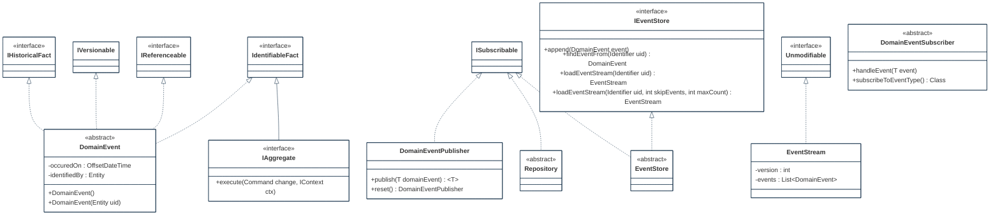
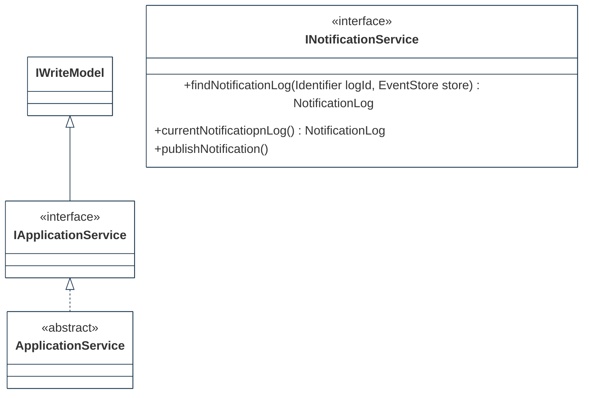
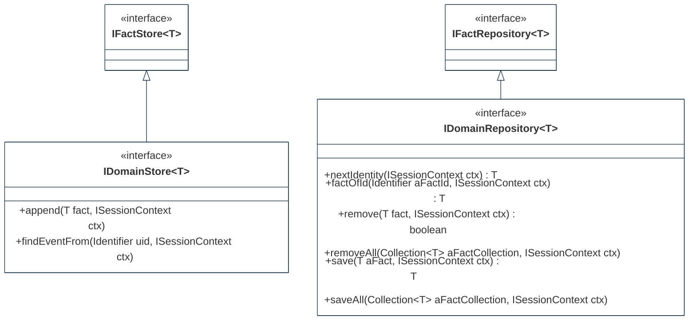

## PURPOSE
Presentation of the deisng view packages and provided components.

# STRUCTURE MODELS

Several packages are implemented to organize the components (e.g specification elements, implementation components) into the `org.cybnity.framework` main package.

## MODEL

## APPLICATION

## INFRASTRUCTURE

#
[Back To Home](README.md)
