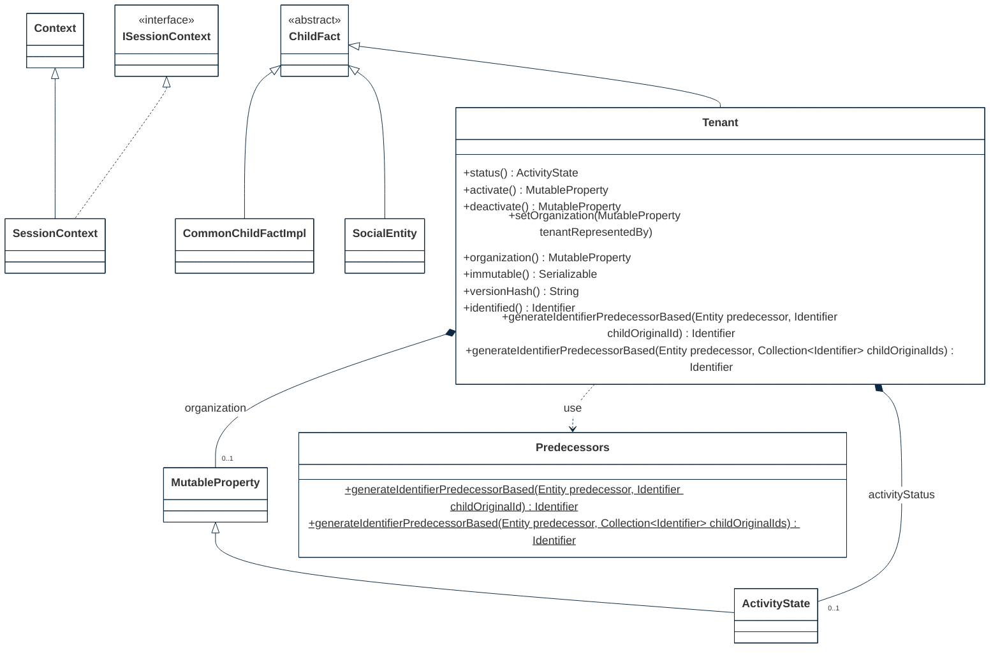

## PURPOSE
Presentation of the deisng view packages and provided components into the `org.cybnity.framework.domain` main project's artifacts package.

# STRUCTURE MODELS
Several sub-packages are implemented to organize the components (e.g specification elements, implementation components) additionnaly to these provided by this package.

## MODEL

## APPLICATION

## INFRASTRUCTURE

#
[Back To Home](README.md)
