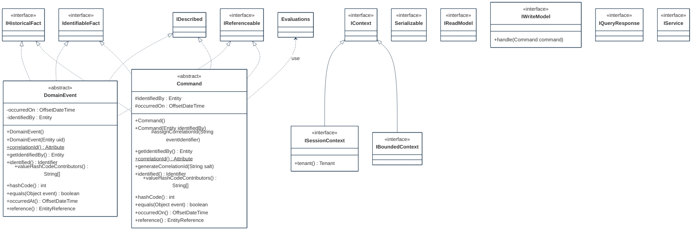
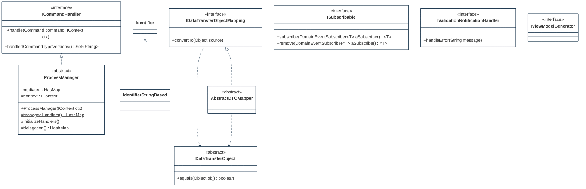
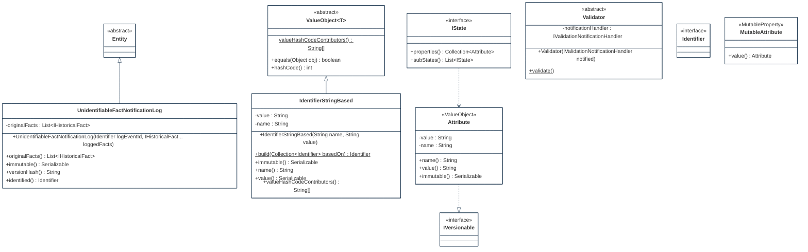

## PURPOSE
Presentation of the structural components regarding architecture implementing domain-driven design patterns.

# DESIGN VIEW
Several structural patterns are supporting the domain (e.g event sourcing) and are reusable (e.g by inheritance) for coding of application domains elements.

### Key Components
For more detail, the technical description regarding behavior and best usage is maintained into the Javadoc of each component.

| Class Type                             | Motivation                                                                                                                                                                                                                                                                                                                                                                                |
|:---------------------------------------|:------------------------------------------------------------------------------------------------------------------------------------------------------------------------------------------------------------------------------------------------------------------------------------------------------------------------------------------------------------------------------------------|
| AbstractDataViewVersionTransactionImpl | Implementation class template representing an unit transaction (e.g create of a data-view version), that is specific to a Query Language supported by the graph model (e.g Gremlin with TinkerPop) for execution of a change operation                                                                                                                                                    |
| AbstractDTOMapper                      | Implementation class type allowing instantiation of DataTransferObject (e.g degraded data view) from other type of object (e.g domain aggregate object). This type of mapper shall be customized by subclass according to the type of DTO expected as output of structure conversion                                                                                                      |
| Attribute                              | Represent a characteristic which can be add to a topic (e.g a technical named attribute which is defined on-fly on an existing object, including a value). It's more or less like a generic property assignable to any topic or object (e.g property on a workflow step instance). For example, can be use to defined a tag regarding a property added to a domain or aggregate object |
| Command                                | Imperative and identifiable element that is a request for the system to perform a task                                                                                                                                                                                                                                                                                                    |
| ConformityViolation                    |                                                                                                                                                                                                                                                                                                                                                                                           |
| DataTransferObject                     | Container of destructured data usable for transport of contents between layers and domains                                                                                                                                                                                                                                                                                                |
| DomainEvent                            | Determine something that has happened in the system (e.g typically as a result of a command, or a change observed regarding a bounded context)                                                                                                                                                                                                                                            |
| EntityReferenceDeserializer            |                                                                                                                                                                                                                                                                                                                                                                                           |
| EntityReferenceSerializer              |                                                                                                                                                                                                                                                                                                                                                                                           |
| EventComparisonCapability              |                                                                                                                                                                                                                                                                                                                                                                                           |
| EventHashingCapability                 |                                                                                                                                                                                                                                                                                                                                                                                           |
| FactTypeDeserializer                   | Custom deserializer of fact type supporting multiple instantiation parameters                                                                                                                                                                                                                                                                                                             |
| FactTypeSerializer                     | Custom serializer of any type of FactType object                                                                                                                                                                                                                                                                                                                                          |
| HistoryStateDeserializer               |                                                                                                                                                                                                                                                                                                                                                                                           |
| HistoryStateSerializer                 |                                                                                                                                                                                                                                                                                                                                                                                           |
| IBoundedContext                        | Represent a defined perimeter providing resources                                                                                                                                                                                                                                                                                                                                         |
| ICommandHandler                        | Responsible of actions realization requested via Command event                                                                                                                                                                                                                                                                                                                            |
| IDataTransferObjectMapping             | Contract of mapping between an object type and a DataTransferObject version                                                                                                                                                                                                                                                                                                               |
| IdentifierSerializer                   |                                                                                                                                                                                                                                                                                                                                                                                           |
| IdentifierStringBased                  |                                                                                                                                                                                                                                                                                                                                                                                           |
| IdentifierStringBasedDeserializer      |                                                                                                                                                                                                                                                                                                                                                                                           |
| IDescribed                             |                                                                                                                                                                                                                                                                                                                                                                                           |
| IPresenceObservability                 |                                                                                                                                                                                                                                                                                                                                                                                           |
| IProjectionTransaction                 | Transaction relative to a projection that can be executed to apply change on data-view projection                                                                                                                                                                                                                                                                                         |
| IQueryResponse                         |                                                                                                                                                                                                                                                                                                                                                                                           |
| IReadModel                             | Denormalized dto repository (also named Query Model) supporting CQRS pattern                                                                                                                                                                                                                                                                                                              |
| IReadModelProjection                   | Represents an optimized read-model projection allowing query and read of denormalized version of domain layer object (e.g status and value of a domain object version at a moment of life)                                                                                                                                                                                                |
| IService                               | Domain service usable to perform a significant business process created in a domain model when the operation feels out of place as a method on an Aggregate or a Value Object                                                                                                                                                                                                             |
| ISessionContext                        | Context regarding a moment of interaction (e.g user interaction with system)                                                                                                                                                                                                                                                                                                              |
| ISnapshotRepository                    | This capability allow to produce or to find the latest snapshot of an Aggregate instance as snapshots which are serialized copies of an Aggregate's full state, taken at certain moments in time, and that can reside in an Event Stream as specific versions                                                                                                                             |
| IState                                 | Represent a providing contract regarding the description of a state (e.g a process step) based on a collection of attributes. A state can include sub-state into its life cycle                                                                                                                                                                                                           |
| ISubscribable                          | Contract of notifications reception about fact events                                                                                                                                                                                                                                                                                                                                     |
| IValidationNotificationHandler         | Handling of problems detected on a subject (e.g Entity attribute) implementing deleted validation approach                                                                                                                                                                                                                                                                                |
| IViewModelGenerator                    | Manager of destructured data production regarding read model view usable by UI layer                                                                                                                                                                                                                                                                                                      |
| IWriteModel                            | Also named Command Model, segregation element (e.g event store) of CQRS pattern managing change commands and normalized data                                                                                                                                                                                                                                                              |
| MutableAttribute                       | Attribute that can be changed, and which need to be historized in an immutable way the history of changes (version of this information)                                                                                                                                                                                                                                                   |
| ObjectMapperBuilder                    |                                                                                                                                                                                                                                                                                                                                                                                           |
| ProcessManager                         | Behavior design pattern, is a mediation component that distribute messages when complex routing between Aggregates                                                                                                                                                                                                                                                                        |
| SerializationFormat                    |                                                                                                                                                                                                                                                                                                                                                                                           |
| SerializedResource                     | Represent a resource based on a serialized resource (e.g java object) that is including a description                                                                                                                                                                                                                                                                                     |
| TypeVersionDeserializer                | Custom deserializer of type version supporting multiple instantiation parameters                                                                                                                                                                                                                                                                                                          |
| TypeVersionSerializer                  | Custom serializer of any type of TypeVersion object                                                                                                                                                                                                                                                                                                                                       |
| UnidentifiableFactNotificationLog      | Log event regarding a fact that was not previously identified but requiring attention (e.g system failure, unknown fact observed                                                                                                                                                                                                                                                          |
| Validator                              | Implementation class of Specification pattern or Strategy pattern that detect invalid state of subject and informs observers                                                                                                                                                                                                                                                              |
| ValueObject                            | Describes a thing in a domain that can be maintained as immutable and integral unit                                                                                                                                                                                                                                                                                                       |

## STRUCTURE MODELS
Presentation of the design view of the `org.cybnity.framework.domain` main project's artifacts package.

### Sub-Packages
See complementary presentation of [detailed structure models implemented into the sub-packages](designview-packages.md).

#
[Back To Home](README.md)
