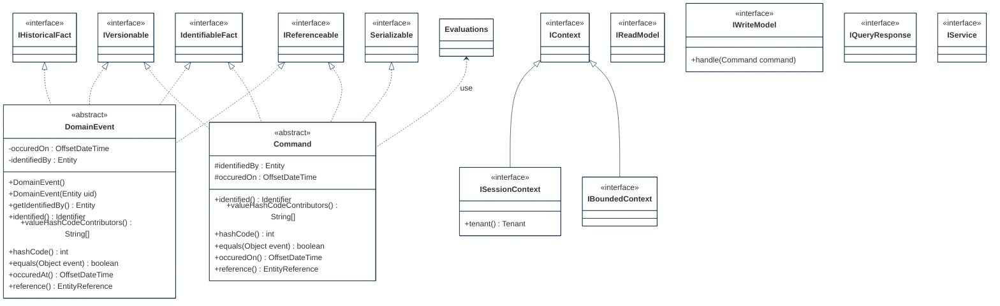
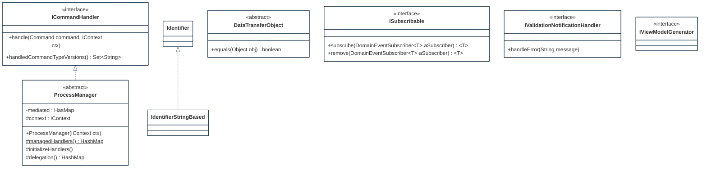
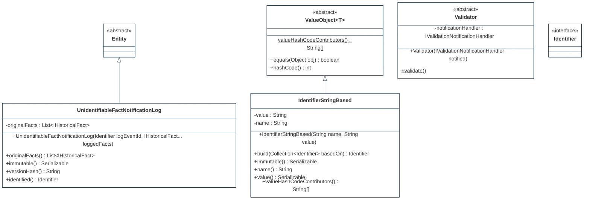

## PURPOSE
Presentation of the structural components regarding architecture implementing domain-driven design patterns.

# DESIGN VIEW
Several structural patterns are supporting the domain (e.g event sourcing) and are reusable (e.g by inheritance) for coding of application domains elements.

### Key Components
For more detail, the technical description regarding behavior and best usage is maintained into the Javadoc of each component.

|Class Type|Motivation|
| :-- | :-- |
|Command|Imperative and identifiabl element that is a request for the system to perform a task|
|DataTransfertObject|Container of destructured data usable for transport of contents between layers and domains|
|DomainEvent|Determine something that has happened in the system (e.g typically as a result of a command, or a change observed regarding a bounded context)|
|IBoundedContext|Represent a defined perimeter providing resources|
|ICommandHandler|Responsible of actions realization requested via Command event|
|IReadModel|Denormalized dto repository (also named Query Model) supporting CQRS pattern|
|IService|Domain service usable to perform a significant business process created in a domain model when the operation feels out of place as a method on an Aggregate or a Value Object|
|ISessionContext|Context regarding a moment of interaction (e.g user interaction with system)|
|ISubscribable|Contract of notifications reception about fact events|
|IValidationNotificationHandler|Handling of problems detected on a subject (e.g Entity attribute) implementing deleted validation approach|
|IViewModelGenerator|Manager of destructured data production regarding read model view usabel by UI layer|
|IWriteModel|Also named Command Model, segregation element (e.g event store) of CQRS pattern managing change commands and normalized data|
|ProcessManager|Behavior design pattern, is a mediation component that distribute messages when complex routing between Aggregates|
|UnidentifiableFactNotificationLog|Log event regarding a fact that was not previously identified but requiring attention (e.g system failure, unknown fact observed|
|Validator|Implementation class of Specification pattern or Strategy pattern that detect invalid state of subject and informs observers|
|ValueObject|Describes a thing in a domain that can be maintained as immutable and integral unit|

## STRUCTURE MODELS
Presentation of the design view of the `org.cybnity.framework.domain` main project's artifacts package.
### Sub-Packages
See complementary presentation of [detailed structure models implemented into the sub-packages](designview-packages.md).

#
[Back To Home](README.md)
