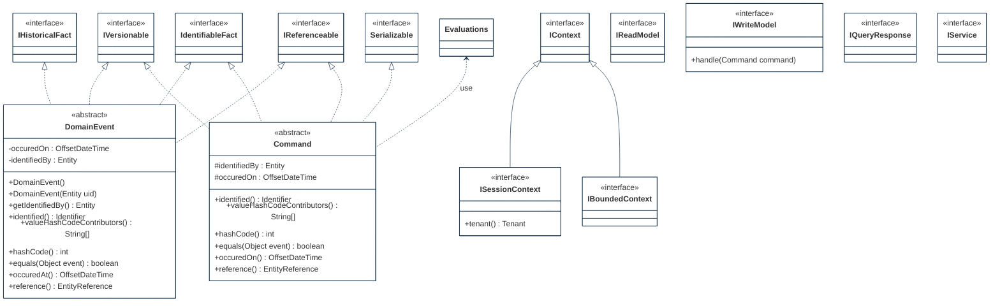

## PURPOSE
Presentation of the structural components regarding architecture implementing domain-driven design patterns.

# DESIGN VIEW
Several structural patterns are supporting the domain (e.g event sourcing) and are reusable (e.g by inheritance) for coding of application domains elements.

### Key Components

|Class Type|Motivation|
| :-- | :-- |
|Command|Imperative and identifiabl element that is a request for the system to perform a task|
|CommandHandlingService|Represent a component which manage handlers regarding specific Aggregate type|
|CommonChildFactImpl|Reusable generic implementation class as child of immutable historical fact|
|DomainEventPublisher|Publishing service from a domain model as repository service for Aggregates notifying their state changes|
|DomainEventSubscriber|Interest contract to be notified when types of facts are changed|
|DomainEvent|Determine something that has happened in the system (e.g typically as a result of a command, or a change observed regarding a bounded context)|
|EventStream|Append-only nature stream of domain events in order of occurence regarding a domain object|
|EventStore|Persistence system of event and aggregate types regarding a single bounded context|
|IAggregate|Identifiable fact that defines a consistency boundary including multiple related objects (e.g domain and/or value objects)|
|IApplicationService|Applicative behaviors contract regarding an application layer|
|IBoundedContext|Represent a defined perimeter providing resources|
|IContext|Generic contact allowing to share and provide information in an area of usage|
|ICommandHandler|Responsible of actions realization requested via Command event|
|IEventStore|Contract regarding storing (with append-only approach) and hydratation of a type of event (e.g versions stream)|
|INotificationService|Publishing of events from event store via messaging infrastructure|
|IReadModel|Denormalized dto repository (also named Query Model) supporting CQRS pattern|
|IService|Domain service usable to perform a significant business process created in a domain model when the operation feels out of place as a method on an Aggregate or a Value Object|
|ISubscribable|Contract of notifications reception about fact events|
|IValidationNotificationHandler|Handling of problems detected on a subject (e.g Entity attribute) implementing deleted validation approach|
|IVersionable|Supports multiple versions of a same event type|
|IWriteModel|Also named Command Model, segregation element (e.g event store) of CQRS pattern managing change commands and normalized data|
|NotificationLog|Log event regarding an identifiable domain fact|
|ProcessManager|Behavior design pattern, is a mediation component that distribute messages when complex routing between Aggregates|
|Repository|Preservation of domain objects. Each persistent Aggregate type have a repository|
|UnidentifiableFactNotificationLog|Log event regarding a fact that was not previously identified but requiring attention (e.g system failure, unknown fact observed|
|Validator|Implementation class of Specification pattern or Strategy pattern that detect invalid state of subject and informs observers|
|ValueObject|Describes a thing in a domain that can be maintained as immutable and integral unit|

## STRUCTURE MODELS
Presentation of the design view of the `org.cybnity.framework.domain` main project's artifacts package.
### Sub-Packages
See complementary presentation of [detailed structure models implemented into the sub-packages](designview-packages.md).

#
[Back To Home](README.md)
