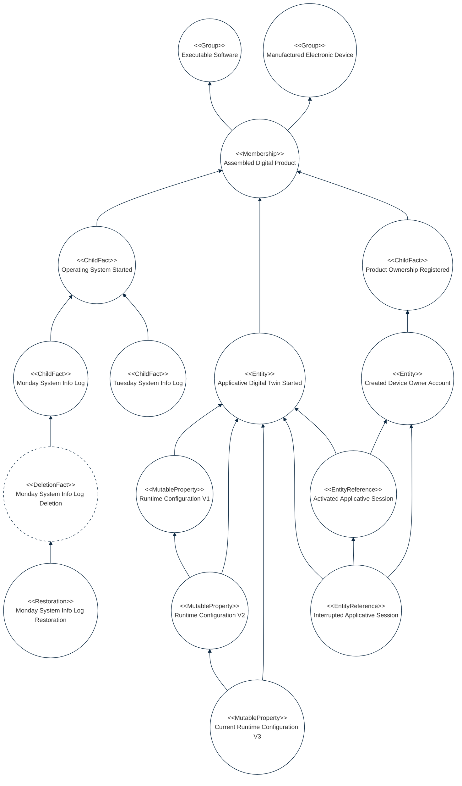

## PURPOSE
Presentation of the transversal framework components regarding architecture components respecting the immutability design patterns.

# FUNCTIONAL VIEW
Presentation of the capabilities area which allow realization of immutability requirements.

### Example of Instantiation
Presentation of an example of instances representing facts history (as events graph) using a object model reusing the structural patterns.

# DESIGN VIEW

- [Structure models presentation](designview-structure-models.md) that give an overview of some key components.
- [Sub-packages structure models](designview-packages.md) detailing specific sub-packages contents.

Several unit tests are implemented into the Maven project and propose examples of best usage of the framework elements (e.g for developer help who can reuse the library's elements).

# RELEASES HISTORY
- [V0 - FRAMEWORK changes list](v0-changes.md)

#
[Back To Home](../README.md)
