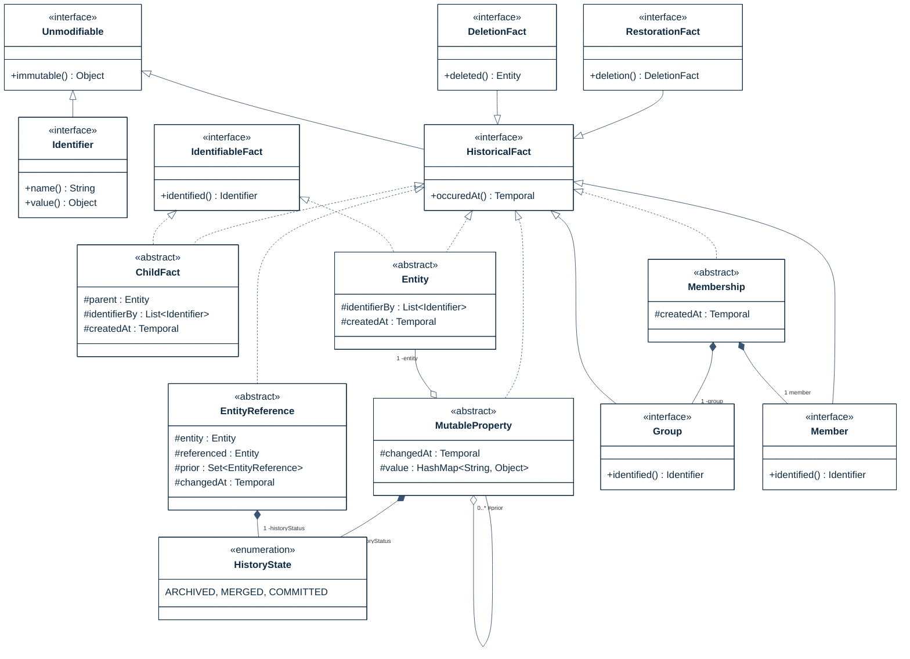

## PURPOSE
Presentation of the transversal framework components regarding architecture components respecting the immutability design patterns.

# DESIGN VIEW
Several structural patterns are supporting the immutability and are reusable (e.g by inheritance) for coding of application domains elements (e.g aggregate, domain object).

|Class Type|Motivation|
| :-- | :-- |
|Entity|Represent the creation of a historical fact equals to a immutable historical fact, containing only identifying information(s)|
|HistoricalFact|Immutable fact created in a system, identified uniquely|
|Identifier|Identifying information (e.g natural key, GUID, or some combination of those and other location-independent identifiers|
|ChildFact|Represent a strict hierarchy among entities (parent-child relationship betwwen a successor and ont of its predecessors). Ownership pattern regarding fact referencing a parent fact as predecessor|
|Unmodifiable|Contract of immutability assignable to any element of the architecture|
|DeletionFact|Represent a deletion of an entity|
|EntityReference|Mutable relationship between entities|
|Group|Logical group regarding a type of entity|
|HistoryState|State of decision taken by a user regarding a previous property value concurrently changed|
|IdentifiableFact|Identification contract regarding an immutable object|
|Member|Represent a member of a logical group into a membership relation|
|Membership|More flexible grouping relationship than the ownership. A many-to-many relationship typically denotes Membership|
|MutableProperty|Represents values that change on a property (simple or complex)|
|Ownership|Special case of the Entity pattern, where the entity's identifiers include the identity of an owner|
|RestorationFact|Restoration fact references a prior deletion. Dxtension of the Delete pattern|

## Structure Models

## Example of objects instantiations
Presentation of a sample of instances which can be linked together according to their roles into a facts graph.

    classDef bddtest fill:#3a5572,stroke:#3a5572,color:#fff
	classDef impact fill:#fff,stroke:#e5302a,stroke-width:1px,color:#e5302a
	classDef goal fill:#0e2a43,stroke:#0e2a43,color:#fff
