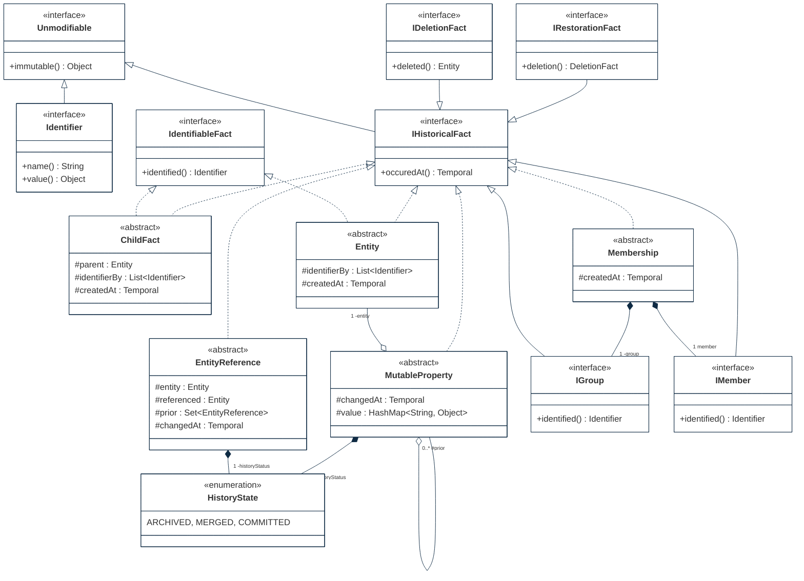

## PURPOSE
Presentation of the transversal framework components regarding architecture components respecting the immutability design patterns.

# DESIGN VIEW
Several structural patterns are supporting the immutability and are reusable (e.g by inheritance) for coding of sofwtare elements (e.g aggregate, value objects).

|Class Type|Motivation|
| :-- | :-- |
|Entity|Represent the creation of a historical fact equals to a immutable historical fact, containing only identifying information(s)|
|IHistoricalFact|Immutable fact created in a system, identified uniquely|
|Identifier|Identifying information (e.g natural key, GUID, or some combination of those and other location-independent identifiers|
|ChildFact|Represent a strict hierarchy among entities (parent-child relationship betwwen a successor and ont of its predecessors). Ownership pattern regarding fact referencing a parent fact as predecessor|
|Unmodifiable|Contract of immutability assignable to any element of the architecture|
|IDeletionFact|Represent a deletion of an entity|
|EntityReference|Mutable relationship between entities|
|IGroup|Logical group regarding a type of entity|
|HistoryState|State of decision taken by a user regarding a previous property value concurrently changed|
|IdentifiableFact|Identification contract regarding an immutable object|
|IMember|Represent a member of a logical group into a membership relation|
|Membership|More flexible grouping relationship than the ownership. A many-to-many relationship typically denotes Membership|
|MutableProperty|Represents values that change on a property (simple or complex)|
|IOwnership|Special case of the Entity pattern, where the entity's identifiers include the identity of an owner|
|IRestorationFact|Restoration fact references a prior deletion. Dxtension of the Delete pattern|

## STRUCTURE MODELS

## EXAMPLE OF INSTANTIATIONS
Presentation of an example of instances representing facts history (as events graph) using a object model reusing the structural patterns.

# RELEASES HISTORY
- [V0 - FRAMEWORK changes list](v0-changes.md)
