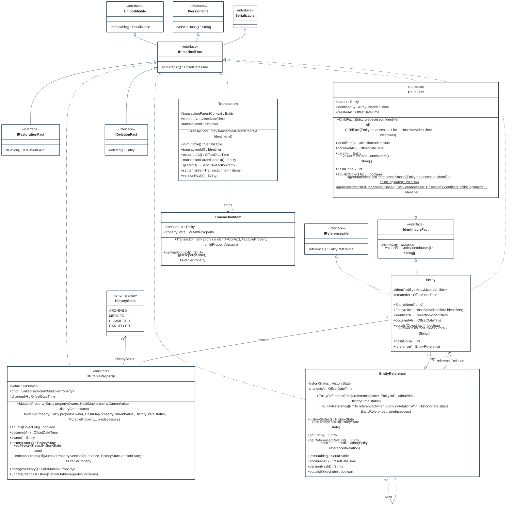
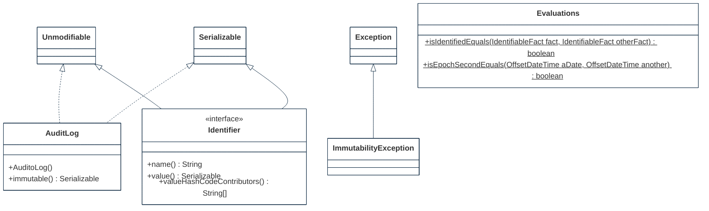
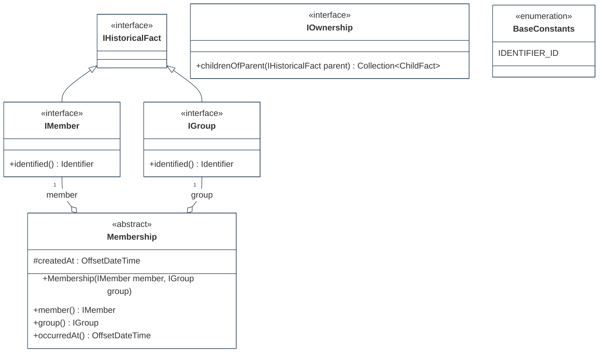
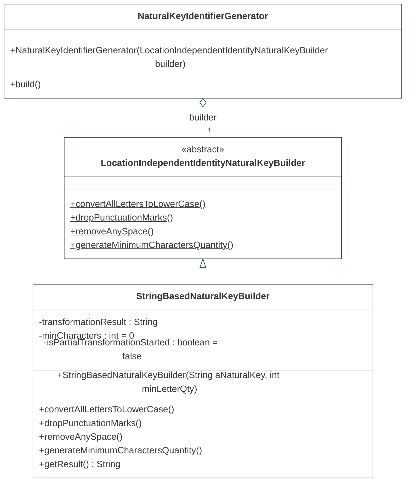
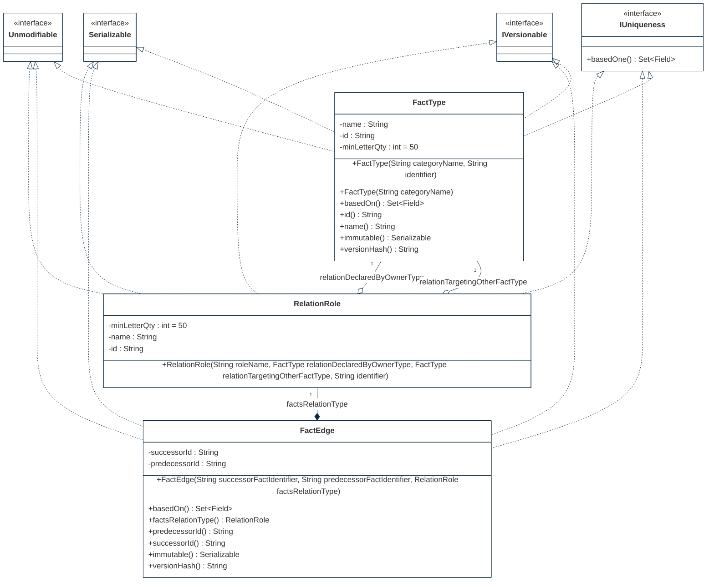
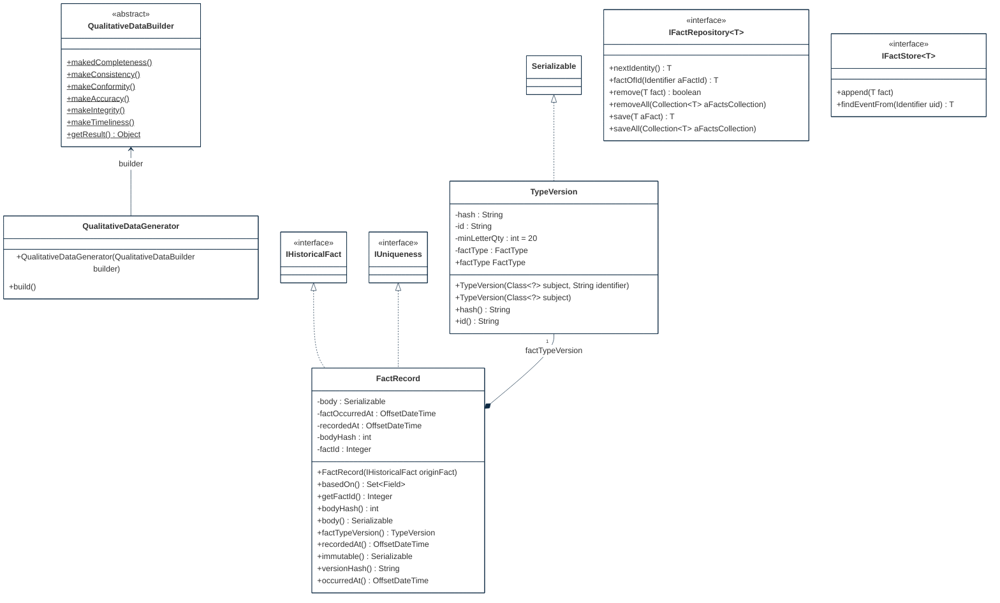
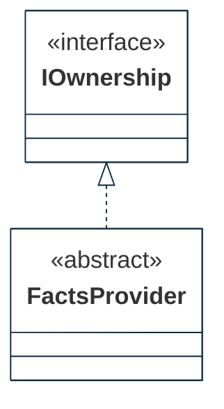
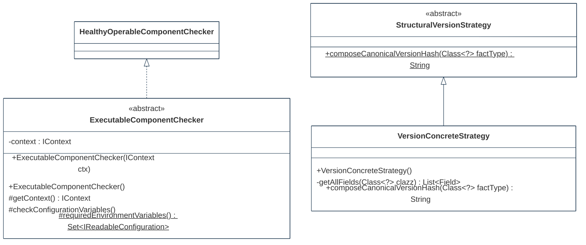

## PURPOSE
Presentation of the design view regarding the sub-packages of `org.cybnity.framework.immutable` project.

# DESIGN VIEW
The technical description regarding behavior and best usage is maintained into the Javadoc of each component.

|Class Type|Motivation|
| :-- | :-- |
|AuditLog| |
|BaseConstants| |
|ChildFact| |
|Entity| |
|EntityReference| |
|Evaluations| |
|ExecutableComponentChecker| |
|FactEdge| |
|FactsProvider| |
|FactRecord| |
|FactType| |
|HistoryState| |
|IDeletionFact| |
|IdentifiableFact| |
|Identifier| |
|IFactRepository| |
|IFactStore| |
|IGroup| |
|IHistoricalFact| |
|IMember| |
|ImmutabilityException| |
|IOwnership| |
|IReferenceable| |
|IRestorationFact| |
|IUniqueness| |
|IVersionable| |
|LocationIndependentIdentityNaturalKeyBuilder| |
|Membership| |
|MutableProperty| |
|NaturalKeyIdentifierGenerator| |
|QualitativeDataBuilder|Builder pattern implementation of data quality ensuring the application of quality rules on object to intantiate|
|QualitativeDataGenerator|Producer of qualitative data that manage execution of quality rules for instance to build as ACID model|
|RelationRole| |
|StringBasedNaturalKeyBuilder| |
|StructuralVersionStrategy| |
|Transaction| |
|TransactionItem| |
|TypeVersion| |
|Unmodifiable| |
|VersionConcreteStrategy| |

# STRUCTURE MODELS
Several packages are implemented to organize the components (e.g specification elements, implementation components) additionnaly to these provided by this package.

# IMMUTABLE
Main project's package regarding the immutability capabilities, this package include severel sub-packages additionnaly to these components.

## PERSISTENCE SUB-PACKAGE

## REGISTRY SUB-PACKAGE

## UTILITY SUB-PACKAGE

#
[Back To Home](README.md)
