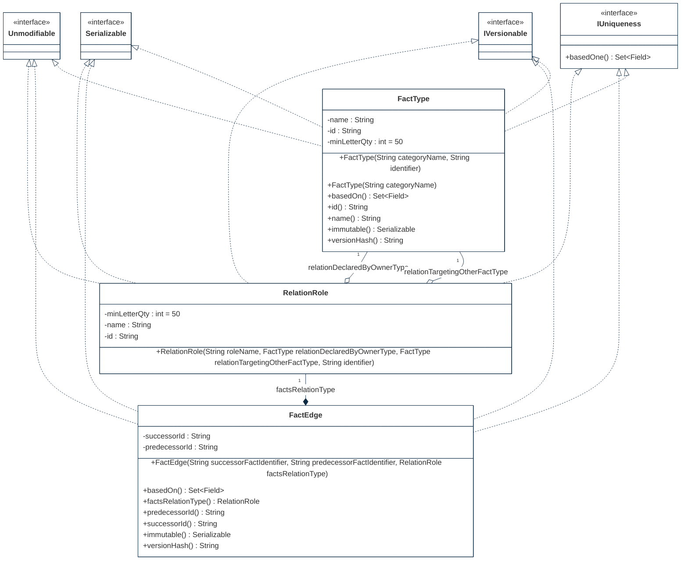

## PURPOSE
Presentation of the design view regarding the sub-packages of `org.cybnity.framework.immutable` project.

# DESIGN VIEW
The technical description regarding behavior and best usage is maintained into the Javadoc of each component.

|Class Type|Motivation|
| :-- | :-- |
|FactEdge| |
|FactRecord| |
|FactType| |
|IFactRepository| |
|IFactStore| |
|IUniqueness| |
|QualitativeDataBuilder|Builder pattern implementation of data quality ensuring the application of quality rules on object to intantiate|
|QualitativeDataGenerator|Producer of qualitative data that manage execution of quality rules for instance to build as ACID model|
|RelationRole| |
|TypeVersion| |

# STRUCTURE MODELS
Several packages are implemented to organize the components (e.g specification elements, implementation components) additionnaly to these provided by this package.

## PERSISTENCE




## REGISTRY

```mermaid
%%{
  init: {
    'theme': 'base',
    'themeVariables': {
        'background': '#ffffff',
        'fontFamily': 'arial',
        'fontSize': '18px',
        'primaryColor': '#fff',
        'primaryBorderColor': '#0e2a43',
        'secondaryBorderColor': '#0e2a43',
        'tertiaryBorderColor': '#0e2a43',
        'edgeLabelBackground':'#0e2a43',
        'lineColor': '#0e2a43',
        'tertiaryColor': '#fff'
    }
  }
}%%
classDiagram


```

## UTILITY

```mermaid
%%{
  init: {
    'theme': 'base',
    'themeVariables': {
        'background': '#ffffff',
        'fontFamily': 'arial',
        'fontSize': '18px',
        'primaryColor': '#fff',
        'primaryBorderColor': '#0e2a43',
        'secondaryBorderColor': '#0e2a43',
        'tertiaryBorderColor': '#0e2a43',
        'edgeLabelBackground':'#0e2a43',
        'lineColor': '#0e2a43',
        'tertiaryColor': '#fff'
    }
  }
}%%
classDiagram


```

#
[Back To Home](README.md)
