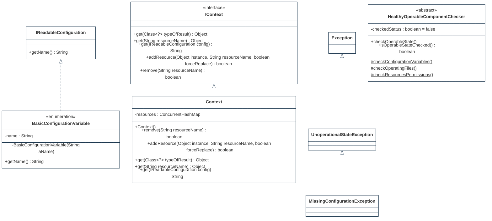

## PURPOSE
Presentation of the structural components regarding architecture implementing immutable design patterns.

# DESIGN VIEW
Several structural patterns are supporting the immutable capabilities and are reusable (e.g by inheritance) for coding of application elements.

### Key Components
For more detail, the technical description regarding behavior and best usage is maintained into the Javadoc of each component.

|Class Type|Motivation|
| :-- | :-- |
|BasicConfigurationVariable| |
|Context| |
|IContext| |
|IReadableConfiguration| |
|MissingConfigurationException| |
|UnoperationalStateException| |

## STRUCTURE MODELS
Presentation of the design view of the `org.cybnity.framework` main project's artifacts package.

### Sub-Packages
See complementary presentation of [detailed structure models implemented into the sub-packages](designview-packages.md).

#
[Back To Home](README.md)
