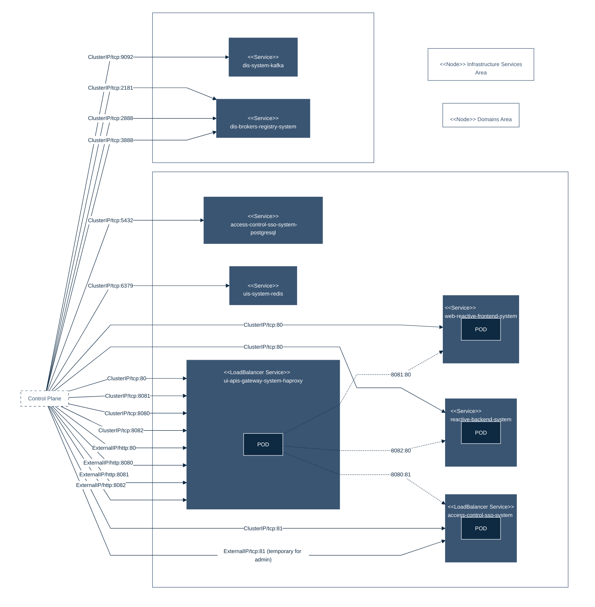

## PURPOSE
Presentation of the projects dedicated to manage the provisioning and orchestration of delivered CYBNITY infrastructure module versions.

The management of several types of modules is approached with an integrated vision that mix the best practices proposed by each used tool, into a global common and compatible architecture of the source codes projects.

To avoid risks (e.g large modules are slow, insecure, difficult to understand/test/review), some modularity requirements are respected for development and maintenance at a Production-grade infrastructure modules:
- Small modules
- Composable modules
- Testable modules
- Releasable modules

Several assembly projects are managed regarding the packaging of modular and deployable systems relative to independent and autonomous containerized systems of security features, and/or integrated applicative modules (e.g aggregation of CYBNITY domain's features).

### DEPLOYMENT VIEW
See the [deployment view documentation](/docs/uml/README.md#deployment-view-systems--applications) for more detail on the design requirements that describe the environments, infrastructures and operating conditions required to install, activate and operate the systems safely.

# SYSTEM PROJECTS
The CYBNITY systems are application components (e.g web backend app, standalone executable java app) that are containerized as __deployable and executable Systems__.

## REUSABLE FRAMEWORK DOCKER IMAGES PROJECTS
Some applicative systems are containerized as Docker images. To do this, a Dockerfile is managed in each application project (e.g a domain backend server sub-project) that is based onto a reusable Docker template maintained in the `containers` folder.
- [jre-tee](../framework/java-tee-container): build project of a securized Java Runtime Environment Docker image defining a Trusted Execution Environment (TTE) reusable by Java custom applications dockerized module.
- [services-registry](../framework/services-registry-container): build project of a securized Zookeeper Docker image (based on Temurin JRE) reusable as dis-brokers-registry by a custom provisioning project.

## CONTAINERIZED APPLICATION SYSTEMS PROJECTS
Perimeter: the deployable application components (e.g Java autonomous application) are containerized as Docker images automatically generated by the Maven tool (e.g during build process supported by the Commit stage). Each application component (initiallly packaged as an executable binary like Jar app or Node.js app) is encapsulated into a dedicated Docker image.

Project type: Maven or Node.js implementation structures; dockerization auto-generated (e.g Dockerfile generation, image template tagging, push to Docker repository) via Maven plugin.

Description: each java application project contains a configuration of its containerization (e.g docker plugin activation into its `pom.xml` file, and a `src\main\docker\xxx-assembly.xml` defining specific jar and files assembled into the application system generated as Docker image). Each application system generated is an extended JRE-TEE docker image, ready for start as an autonomous system. Help documentation about the used maven plugin is available [here](https://dmp.fabric8.io/#introduction).
- [reactive-messaging-gateway](charts/reactive-messaging-gateway): provisioning project of [containerized web backend server](../cockpit-foundations/reactive-messaging-gateway).
- [web-reactive-frontend](charts/web-reactive-frontend): provisioning project of [containerized web frontend server](../cockpit-foundations/web-reactive-frontend).

## REUSABLE PROVISIONING SYSTEM PROJECTS
Perimeter: some infrastructure third-party software (e.g Zookeeper application) are available on the market as template of provisioning helping to quickly customize the runtime (provisioning of pre-configured Docker image) into a Kubernetes platform. Some infrastructure components are reused by CYBNITY as infrastructure systems with customization of the prepared templates of their images helmization.

Project type: Helm implementation structures.

Description: several generic infrastructure projects required by the CYBNITY implementation architecture are managed.
- [users-interactions-space](charts/users-interactions-space): bitnami Helm project of Redis image provisioning, customized for the CYBNITY needs (e.g implementation of collaboration space in UI area). This provisioning project is deployable and is supported by a `bitnami/redis` version including `7.0.8-debian-11-r0` operating system libraries. This implementatio (hosted on [ArtifactHUB](https://artifacthub.io/packages/helm/goauthentik/redis)) is currently used to reduce the maintenance effort of a dedicated Helm project based on the `infrastructure\integration\system\users-interactions-broker` docker image project.
- [domains-interactions-space](charts/domains-interactions-space): bitnami Helm project of Kafka image provisioning, customized for the CYBNITY needs (e.g implementation of collaboration space in Domains I/O area). This provisioning project is deployable and is supported by a `bitnami/kafka` version including `3.3.2-debian-11-r0` operating system libraries. This implementatio (hosted on [ArtifactHUB](https://artifacthub.io/packages/helm/bitnami/kafka)) is currently used to reduce the maintenance effort of a dedicated Helm project based on the `infrastructure\integration\system\domains-interactions-broker` docker image project.
   - [dis-brokers-registry-system](charts/domains-interactions-space/charts/zookeeper): included sub-project of Zookeeper image provisioning, customized for the CYBNITY needs (e.g included as implementation of Kafka brokers registry). This provisioning project is deployable and is supported by a `bitnami/zookeeper` version including a `3.8.0-debian-11-r74` operating system libraries. This implementation (hosted on [ArtifactHUB](https://artifacthub.io/packages/helm/riftbit/zookeeper)) is currently used to reduce the maintenance effort of a dedicated Helm project based on the `framework\services-registry-container` docker image project.
- [ui-apis-gateway](charts/ui-apis-gateway): bitnami Helm project of NGINX and Ingress controller image provisioning, csutomized for the CYBNITY needs.

### STANDARD STRUCTURE OF A CONTAINERIZED JAVA APPLICATION
Example of a `reactive-messaging-gateway` application system project structure:

```
reactive-messaging-gateway
├── src
│   └── main
│       ├── java
│       │   └── <<java source code packages>>
│       │       └── ... (.java files)
│       └── docker
│           └── shaded-artifact-docker-assembly.xml
├── pom.xml
└── target
    ├── classes
    │   └── <<compiled java class packages>>
    ├── docker
    │   └── <<name of a docker image auto-generated as application system template (e.g reactive-messaging-gateway)>>
    │       └── build
    │           ├── Dockerfile (<< Docker generated template>>)
    │           └── maven
    │               └── <<.jar packaged application component ready for image start>> (e.g reactive-messaging-gateway-0.1.0-fat.jar)
    └── ...
```

## PROVISIONED SYSTEMS ARCHITECTURE


# INFRASTRUCTURE PROJECTS
The infrastructure projects governs the provisioning management at the Kubernetes level as an Infrastructure-As-Code implementation.

## APPLICATION MODULES PROJECTS
Perimeter: packaged applicative or infrastructure modular systems as Services (Kubernetes service) that can be executed (e.g capability to be deployed into an environment).

Project type: Terraform implementation structure.

Description: main sub-folder is named `services` which contain a sub-folder per any type of modularized system supported by Infrastructure-As-Code implementation. An implemented module can represent a deployment module of an infrastructure Service (e.g Kubernetes service, CYBNITY application service) or System (e.g a cluster of backend application systems, a availability zone implemented by a Kubernetes Node).

## GENERIC INFRASTRUCTURE MODULES PROJECTS
Perimeter: generic, reusable and standalone modules for deploying infrastructure modules (e.g a public load balancer).

Project type: Terraform implementation structure.

Description: some specific sub-folders are created per type of generic technical module type (e.g all the modules relative to the networking activities are hosted into a `networking` folder) regarding generic/standalone modules (e.g only one instance of alb between several area or cluster of frontend application modules) is supported by a dedicated sub-folder named by its logical name (e.g alb regarding a Application Load Balancer as `network module name`). The goal is to define one time the generic/reusable modules which are not clusterized.

## DEPLOYMENT MODULES PROJECTS
Perimeter:  generic, reusable and standalone modules implementing the deployment of clusterized infrastructure/applicative modules (e.g a cluster of multiple CYBNITY application modules).

Project type: Terraform implementation structure.

Description one specific sub-folder is created for each type of clusterized module (e.g named specifically as a __function name__ equals to a suffix `-rolling-deploy` of the managed targeted module) into the `cluster` sub-folder. For example, a terraformed deployment module (e.g Auto Scaling Group module deployed in a rolling deployment approach the webserver-cluster of a application module, named `asg-rolling-deploy`) can do a zero-downtime rolling deployment betwen several instance of an applicative or infrastructure module.

## ENVIRONMENT MODULES PROJECTS
Perimeter: configuration setting projects of Environments (e.g Kubernetes clusters) that can be activated, operated, monitored and restored regarding packaged Services.

Project type: Terraform implementation structure.

Description: main folder is [modules](modules) which contain a sub-folder per __environment name__ (e.g local dev, integrated dev, test, staging & QA, live) equals to a Terraformed module where sub-modules can be operated. One configuration file (e.g .tf, .yaml) is implememented per cluster managed in the source codes repository including labeled deployment. One cluster defined by environment with fault tolerance and HA.
- Local (LOCAL): developer's workstation terraformed environment (e.g laptop with OS and Minikube runtime platform). This environment is also supported by Maven tool profile named `localhost` and activated by default during Java component build life cycle
- Integrated development (DEV): terraformed server infrastructure supporting a shared software development version (e.g temporary during a developers team validation between several features currently in coding step). This environment is also supported by Maven tool profile named `dev-deploy-environment` and activable during build life cycle with property `environment=dev-deploy`
- Quality Acceptance (QA): terraformed server infrastructure supporting a software version qualification process as test environment. This environment is also supported by Maven tool profile named `qa-environment` and activable during build life cycle with property `environment=qa`
- Production (LIVE): terraformed production server infrastructure supporting the applications and services hosted for the use by final users as a Live environment.

## STANDARD STRUCTURE OF MODULES PROJECT
The integrated terraformed modules are managed via the standard project structure:

```
modules
├── live-env
│   ├── cluster
│   │   ├── <<clusterized module name>>-<<function>>
│   │   │   ├── main.tf
│   │   │   ├── outputs.tf
│   │   │   └── variables.tf
│   │   └── <<clusterized module name>>
│   │       ├── main.tf
│   │       ├── outputs.tf
│   │       └── variables.tf
│   ├── networking
│   │   └── <<network module name>>
│   │       ├── main.tf
│   │       ├── outputs.tf
│   │       └── variables.tf
│   └── services
│       └── <<CYBNITY application module/service name>>
│           ├── main.tf
│           ├── outputs.tf
│           └── variables.tf
├── qa-env
├── dev-env
└── local-env
```

Corresponding test and examples structures are implemented and should be equals to the implemented modules allowing to make multiple tests for each module, witch each example showing different configurations and permutations of how that module can be used.

```
test
├── qa-env
│   ├── cluster
│   ├── networking
│   └── services
├── dev-env
└── local-env

examples
├── qa-env
│   ├── cluster
│   │   └── <<clusterized module name>>-<<function>>
│   │       ├── one-instance
│   │       │   ├── main.tf
│   │       │   ├── outputs.tf
│   │       │   └── variables.tf
│   │       ├── auto-scaling
│   │       │   ├── main.tf
│   │       │   ├── outputs.tf
│   │       │   └── variables.tf
│   │       ├── with-load-balancer
│   │       │   ├── main.tf
│   │       │   ├── outputs.tf
│   │       │   └── variables.tf
│   │       └── custom-tags
│   ├── networking
│   └── services
├── dev-env
└── local-env
```
