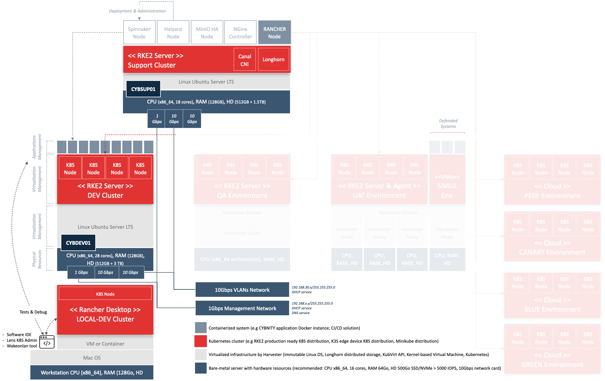

## PURPOSE
Some infrastructure technical systems are deployed by CYBNITY project as dedicated to "Build and Delivery activities" relative to CYBNITY software suite.

Each version of infrastructure is a set of components that can be see as a template of support resources which shall be installed by any company that would like:
- to develop or to extend CYBNITY software suite in an autonomous way onto their servers
- to test the CYBNITY software modules allowing to customize or to optimize their performance according to a company's needs
- to deliver configured systems, operational applications and/or support services
- to provide a production environment to final users (e.g a company's security team) in a SaaS approach or into a on-premise infrastructure

This documentation present an integrated infrastructures version of CYBUILD (CYBNITY Build Platform) and CYDEL (CYBNITY Delivery Platform) implemented and deployed as the __CYBFAC Version 01__ (CYBNITY Factory).

See here mode detail about the [standardized software factory model](../../../docs/README.md).

# INFRASTRUCTURES
See here the model of physical resources installed by CYBNITY to support the project's modules build and delivery, with ability to install and operate technical activities (local or centralized development, test in continuous integration approach, performance evaluation, demonstration of CYBNITY software suite version to partners, and basic production for small companies).

For more detail about technical and resources pre-required to support by this type of resources infrastructure, consult the [system and tools prerequisites documentation](../systems-and-tools-prerequisites.md).

# COMPONENTS & GUIDELINES
Technical documentations are available to present in detail the administration procedures that allow to install and to manage the __infrastructures elements involved__ into CYDEL 01.

The configuration instructions are helping to deploy and to manage the systems (e.g hardware, virtualized components, tooling, network) for help the system deployer and/or infrastructure administrator.

## NETWORK INFRASTRUCTURE
Primary connectivity network is based on 10G rate LAN (Cat7 cabled) supporting the direct exchange between the CYDEL01 servers.

Interconnection of physical servers is supported by a 10G Ethernet managed switch.

## SUPPORT INFRASTRUCTURE
This area of technical components and/or services are dedicated to support the other environments as tools (e.g Continuous Delivery of application components on environment) and shared services (e.g virtualization systems and containers management):
- [CYDEL01 - Support primary resources server](CYDEL01-cybsup01.md)

## DEVELOPMENT
This area of technical components and/or resources are dedicated to centralized development activities as shared CYBNITY software suite development cluster (e.g allowing developers of application components to merge and test CYBNITY software components that are versioned over the STAGING branch and/or that need temporary deployment from a development feature branch):
- [CYDEL02 - Development cluster primary server](CYDEL01-cybdev02.md)
- [CYDEL01 - Development cluster worker server](CYDEL01-cybdev01.md)

## VALIDATION INFRASTRUCTURE

## SIMULATION INFRASTRUCTURE

## PRODUCTION INFRASTRUCTURE

#
[Back To Home](../README.md)
