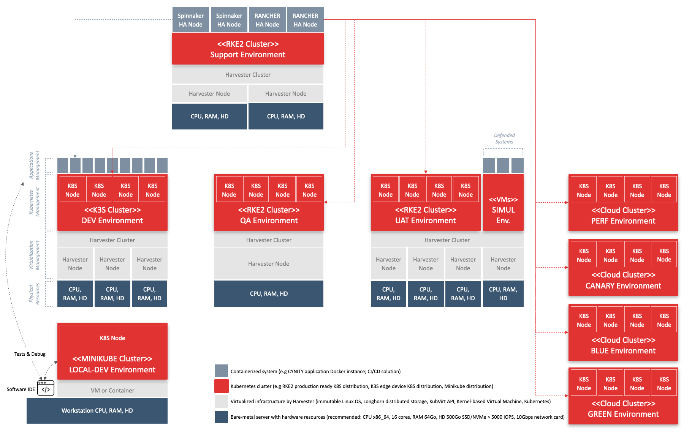

## PURPOSE
Some infrastructure technical systems are deployed by CYBNITY project as dedicated to "Build activities" relative to CYBNITY software suite, and can be see as a template of support resources which shall be installed by any company that would like:
- to develop or to extend CYBNITY software suite in an autonomous way onto their servers
- to test the CYBNITY software modules allowing to customize or to optimize their performance according to a company's needs
- to provide a production environment to final users (e.g a company's security team) in a SaaS approach or into a on-premise infrastructure

# CYBNITY BUILD & DELIVERY INFRASTRUCTURES
See here the model of physical resources installed by CYBNITY to support the project's modules build and delivery, with ability to install and operate technical activities (local or centralized development, test in continuous integration approach, performance evaluation, demonstration of CYBNITY software suite version to partners, and basic production for small companies).

For more detail about technical and resources pre-required to support by this type of resources infrastructure, consult the [system and tools prerequisites documentation](../systems-and-tools-prerequisites.md).

#
[Back To Home](../README.md)
