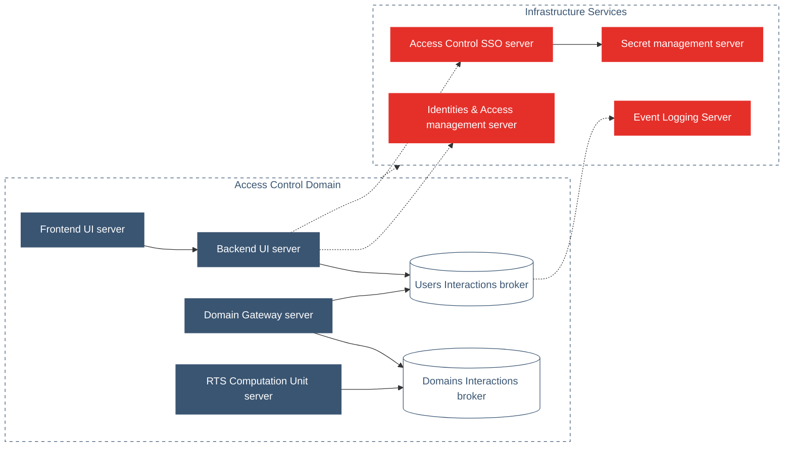

## PURPOSE
This project space is dedicated to the prototyping of Foundation TechStack initial version.
Main goal is to validate the compatibility of technologies set assembly, their promises reality and to support the acceptance step (step 2) of the [demonstrator V0](https://github.com/cybnity/foundation-techstack/blob/0aa4d70e4b1c880e1ebec00f51ea7dd7947fee4d/demonstrators-line/demonstrator-v0/technologies-stack-analysis.md)

# PROTOTYPE PERIMETER
## EVALUATED SET
| TECHNOLOGY | VERSION | COMMENTS | HELP / SUPPORT |
| :--- | :--- | :--- | :--- |
| [ReactBootstrap](https://react-bootstrap.github.io/) |v2.4.0 (Bootstrap 5.1)| |- [Getting started](https://react-bootstrap.github.io/getting-started/introduction)|
| [Eclipse Vert.x SockJS Client](https://github.com/sockjs/sockjs-client) |1.6.1| | |
| [ReactJS](https://reactjs.org/) |18.1.0| |- [Documentations](https://reactjs.org/docs/getting-started.html)|
| Eclipse Vert.x Core |4.3.1| |- [Documentation](https://vertx.io/docs/vertx-core/java/) - JDK 1.8+ - [GitHub project](https://github.com/eclipse-vertx/vert.x/releases)|
| Eclipse Vert.x Web |4.3.1| |- [Documentation](https://vertx.io/docs/vertx-web/java/)|
| [Apache Directory Server](https://directory.apache.org/) |2.0.0| |- [Apache directory studio](https://directory.apache.org/studio/) LDAP browser|
| midPoint | | |- [Installation requirements](https://docs.evolveum.com/midpoint/install/system-requirements/) - [Docker Alpine image installation](https://docs.evolveum.com/midpoint/install/docker/) - [Tutorial](https://evolveum.com/get-started/)|
| [Vault](https://www.vaultproject.io/) | | |- [docker image](https://hub.docker.com/_/vault/) - [Installations](https://www.vaultproject.io/downloads) - [Helm example](https://www.vaultproject.io/docs/platform/k8s/helm) - [Vault Helm Charts](https://github.com/hashicorp/vault-helm)|
| [Keycloack](https://www.keycloak.org/) | | |- [Docker image](https://www.keycloak.org/server/containers) - [Extensions](https://www.keycloak.org/extensions.html) - [Theming extension with React](https://www.keycloakify.dev/)|
| [Jedis](https://github.com/redis/jedis) | | | |
| Redis | | |- [Documentations](https://redis.io/docs/)|
| [Apache Kafka](https://kafka.apache.org/) | | |- [Documentations](https://kafka.apache.org/documentation/)|
| Apache Flink | | |- [Installation](https://flink.apache.org/downloads.html) - [Visualizer web app](https://flink.apache.org/visualizer/) - [Redis Connector](https://bahir.apache.org/docs/flink/current/flink-streaming-redis/) - [Connectors](https://flink-packages.org/)|
| [Telegraf Agent](https://www.influxdata.com/time-series-platform/telegraf/) | | |- [Documentation](https://docs.influxdata.com/telegraf/v1.22/)|
| [InfluxDB](https://www.influxdata.com/) | | |- [Installation](https://portal.influxdata.com/downloads/)|
| Spring Core | | |- [Core documentation](https://docs.spring.io/spring-framework/docs/current/reference/html/core.html) - [Spring Vault](https://spring.io/projects/spring-vault) - [Accessing Vault](https://spring.io/guides/gs/accessing-vault/) - [Valut configuration](https://spring.io/guides/gs/vault-config/) - [Spring Kafka](https://spring.io/projects/spring-kafka) - [Messaging with Redis](https://spring.io/guides/gs/messaging-redis/)|
| [Spring Boot](https://spring.io/projects/spring-boot) | | |- [SpringBoot with Docker](https://spring.io/guides/gs/spring-boot-docker/)|
| [Apache Zookeeper](https://zookeeper.apache.org) | | |- [Documentation](https://zookeeper.apache.org/doc/r3.8.0/index.html) - [Java example](https://zookeeper.apache.org/doc/r3.8.0/javaExample.html) - [Standalone local instance installation](https://zookeeper.apache.org/doc/r3.8.0/zookeeperStarted.html#sc_InstallingSingleMode)|
| Eclipse OpenJ9 8/11 JRE | | |- [Documentation](https://www.eclipse.org/openj9/docs/index.html) - [Developer tooling](https://www.eclipse.org/openj9/docs/tool_migration/)|
| Linux Ubuntu LTS (minimal for Docker)| | | |
| Docker | | |- [Documentations](https://docs.docker.com/)|
| MicroK8s | | |- [Snapd install](https://snapcraft.io/snapd)|

## TARGETED ACTIONS
- Installation of each technology according to the Foundation architecture
- Test of configuration per technology allowing their technical collaboration
- Implementation of a basic test (e.g HelloWorld) with basic source codes allowing to check the good integration between each technology
- Update of results and observations into the technology stack analysis page of Demonstrator V0

# PROTOTYPE IMPLEMENTATION

## SYSTEMS BOUNDARY
A specific systems area is built and prepared for execution test as Proof-Of-Concept (POC) of integrated technologies.

The main applications focused for the POC is:
- **Asset Control** application as deployable CYBNITY system including a sample of read capability (e.g read a sample of asset description)
  - **Frontend UI server** (asset control UI frontend implementation module) **as UI system**;
  - **Backend UI server** (asset control UI backend implementation module) **as server-side backend system**;
  - **Domain Gateway server** (asset control application implementation module) **as domain application services layer system** managing stateless anti-corruption layer;
  - **RTS Computation Unit server** (asset control RTS computation unit implementation module) **as domain model system** providing domain feature about Asset.

The main infrastructure services focused for the POC are:
- For integration tests between UI layer's components and application layer
  - **Users Interactions broker** (users interactions infrastructure implementation module) **as UI layer's collaboration area**.
- For integration tests between collaboration spaces and gateway layer
  - **Domains Interactions broker**
- For check of security integration tests between applicative systems
  - **Access Control SSO server** (access control and Single-Sign-On infrastructure implementation module) **as security manager of frontend access**;
  - **Identities & Access management server** (identity and access management infrastructure implementation module) **as UIAM system**;
  - **Secret management server** (secret management infrastructure implementation module) **as strong-box system**.
- For check of tracking capabilities regarding systems
  - **Event Logging server** (event logging infrastructure implementation module) **as activity/event logs store**.

## TECHNOLOGY
Several technologies are selected into the stack version for implementation of components and systems.

| SYSTEM | TYPE | TECHNOLOGIES | COMMENTS |
| :--- | :--- | :--- | :--- |
|Asset Control FrontEnd UI server|Web Reactive FrontEnd|- ReactBootstrap - ReactJS Vert.x SockJS Client - Google Chrome web browser| |
|Asset Control BackEnd UI server|Reactive BackEnd Server|- Vert.x Web - Jedis - Vert.x Core - OpenJ9 JVM - Ubuntu OS - Docker Image - MicroK8s|JSON/HTTPS over SSO|
|Asset Control & SSO server|Security Services|- Keycloack - OpenJ9 JVM - Ubuntu OS - Docker Image - MicroK8s|Token management for front/backend's user access|
|Identities Access Management server|Security Services|- midPoint - Apache Directory Server - OpenJ9 JVM - Alpine Linux OS - Docker Image - MicroK8s|Include test account allowing call of Access domain read feature, and access check by application layer when coming from UI layer|
|Secret Management server|Security Services|- Vault - Ubuntu OS - Docker Image - MicroK8s|Test of storage/retrieve of user token used by Asset Control & SSO server|
|Users Interactions broker|Users Interactions Space|- Redis Cluster - Telegraf Agent - Ubuntu OS - Docker Image - MicroK8s|Telegrag agent (plugin for Redis cluster) push monitoring to Event Logging Server|
|Event Logging server|Logging|- InfluxDB - Ubuntu OS - Docker Image - MicroK8s|Logs repository regarding Redis instances' activities|
|Asset Control Domain Gateway server|Domains Gateway Server|- Java Kafka POJO - Zookeeper Client - Jedis - Kafka Connector - Spring Core - SpringBoot - OpenJ9 JVM - Ubuntu OS - Docker Image - MicroK8s|Sample code which integrate the request (e.g validate a request parameter like "asset name to read") of UI layer to domain, and execute the requested feature (e.g read of an asset description) via delegation to a RT computation unit (e.g domain model of Asset Control implementing the Security Feature named Asset); Java Processor/Consumer as domain application service layer|
|Domains Interactions broker|Events Brokers Cluster (Domains Interactions Space)|- Kafka Broker instance -Zookeeper Registry - OpenJ9 JVM - Ubuntu OS - Docker Image - MicroK8s| Kafka cluster|
|RTS Computation Unit server|Real-Time Stream Computation Unit|- Apache Flink - Zookeeper Client - Kafka Connector - Flink CEP - OpenJ9 JVM - Docker Image|Asset feature java implementation with Flink; Flink CEP test for command chain pattern implementation that build the Asset description requested by the UI layer and provider by the Domain model|
